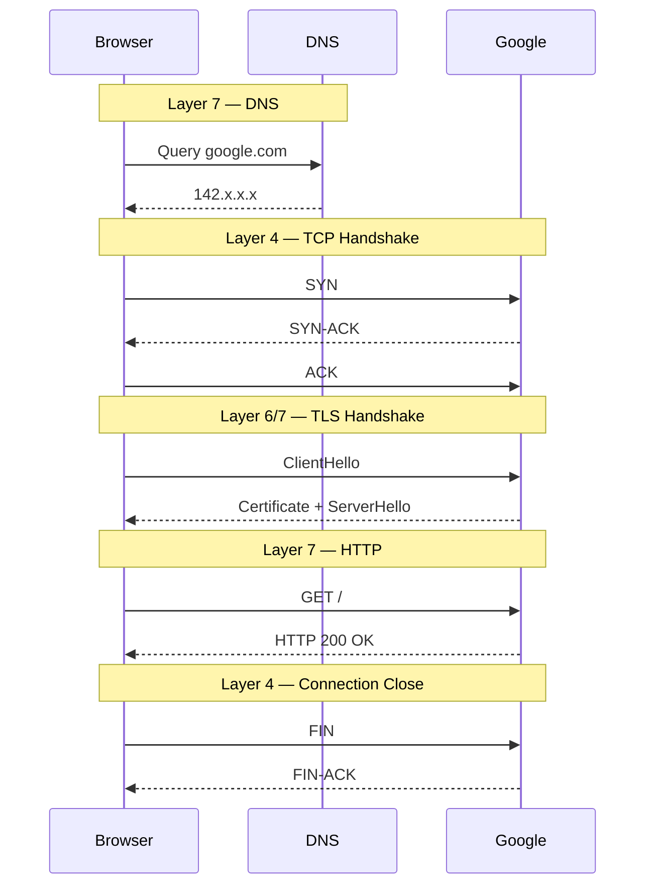

# Lab 00 — How the Internet Works (OSI Model, TCP/IP Model)


## Prerequisites

None. This is the first lab.

## Tools Used

```
curl        — make HTTP requests and see every step verbosely
ping        — test layer 3 reachability
dig         — query DNS
ip          — read network interfaces and routing table
ss          — see active connections and listening ports
tcpdump     — capture real packets (brief intro only, deep dive in Lab 02)
```

## Notes

- All commands in this lab run inside WSL2 terminal


## Concept

### The Analogy: Sending a Letter Internationally

Imagine you want to send a letter from Pakistan to someone in the USA.

Here is what happens physically:

```
You write the letter          → this is your data (HTTP, the actual message)
You put it in an envelope     → this is TCP (delivery rules, tracking)
You write the address on it   → this is IP (where it goes)
The postman picks it up       → this is Ethernet (local physical delivery)
```

Each layer wraps the one above it. The recipient unwraps in reverse order.
This wrapping and unwrapping is called **encapsulation**.

Nobody at the post office reads your letter. They only look at the envelope.
Nobody on the network reads your HTTP data. Routers only look at IP headers.


### The OSI Model — The Reference Map (7 layers)

OSI (Open Systems Interconnection) is a theoretical model.
You will hear it in interviews. Network engineers use it to talk about problems.
"That is a Layer 4 issue" means a TCP or UDP problem.
"Layer 7 load balancer" means it understands HTTP.

| Layer | Name | Purpose | Common Protocols |
|---|---|---|---|
| 7 | Application | What the application sends | HTTP, DNS, FTP, SSH, SMTP |
| 6 | Presentation | Encryption, encoding, compression | TLS/SSL, JPEG, ASCII |
| 5 | Session | Session management and authentication | RPC, NetBIOS |
| 4 | Transport | Reliable/unreliable delivery, ports | TCP, UDP |
| 3 | Network | Addressing and routing | IP, ICMP |
| 2 | Data Link | Local network communication | Ethernet, ARP |
| 1 | Physical | Signals and hardware transmission | Cables, WiFi, Fiber |

**Memory trick:** "All People Seem To Need Data Processing" (7 down to 1)
Or bottom up: "Please Do Not Throw Sausage Pizza Away" (1 up to 7)


### The TCP/IP Model — What Actually Runs (4 layers)

TCP/IP is what your computer actually implements.
It collapses OSI's 7 layers into 4 practical ones.
This is what you work with every day.


| TCP/IP Layer | Maps to OSI Layers | Purpose | Common Protocols |
|---|---|---|---|
| Application | 5, 6, 7 | What your application says | HTTP, HTTPS, DNS, SSH, FTP, SMTP |
| Transport | 4 | How data gets delivered reliably | TCP, UDP |
| Internet | 3 | Where data gets delivered | IP, ICMP |
| Network Access | 1, 2 | How data physically moves on the network | Ethernet, ARP, WiFi, MAC |

### Mental Model

| Layer | Simple Meaning |
|---|---|
| Application | The actual message |
| Transport | Delivery rules and reliability |
| Internet | Addressing and routing |
| Network Access | Physical/local network movement |


**Key difference:**
OSI = the full recipe book. Useful for learning and discussions.
TCP/IP = the actual cooking. What runs on every device.

When someone says "Layer 4" they mean Transport (TCP/UDP) in both models.
When someone says "Layer 7" they mean Application (HTTP/DNS) in both models.


### What Happens When You Type a URL — The Full Story

```
You type: https://www.google.com and press Enter
```

**Step 1 — DNS lookup (Application Layer)**

Your browser does not know the IP address of google.com.
It asks a DNS resolver: "What is the IP for google.com?"
DNS is like a contacts app. Names → Numbers.
The resolver first checks its cache.
If the answer is not cached, it recursively queries other DNS servers until it finds the IP address.
Answer comes back: 142.250.x.x

```
Browser → DNS resolver → answer: 142.250.x.x
```

**Step 2 — TCP connection (Transport Layer)**

Your browser now opens a reliable connection to 142.250.x.x port 443.
TCP uses a three-way handshake:

```
Your machine  →  SYN           →  Google server
Your machine  ←  SYN-ACK       ←  Google server
Your machine  →  ACK           →  Google server
              Connection established
```

Think of it as:
```
You: "Hello, can we talk?"     (SYN)
Google: "Yes, I'm ready"       (SYN-ACK)
You: "Great, let's go"         (ACK)
```

**Step 3 — TLS handshake (Application/Presentation Layer)**

Because this is HTTPS, the connection is encrypted.
Your browser and Google negotiate encryption keys.
Nobody between you can read what follows.

```
Browser → ClientHello (supported ciphers, TLS version)
Google  → ServerHello + Certificate
Browser → verifies certificate is trusted
Both    → derive session keys
          Encrypted tunnel established
```

**Step 4 — HTTP request (Application Layer)**

Now your browser sends an HTTP GET request through the encrypted tunnel:

```
GET / HTTP/2
Host: www.google.com
User-Agent: Mozilla/5.0 ...
Accept: text/html
```

**Step 5 — HTTP response (Application Layer)**

Google sends back the HTML:

```
HTTP/2 200 OK
Content-Type: text/html
...
<html>...</html>
```

**Step 6 — TCP connection closed (Transport Layer)**

After the response, the connection closes:

```
Browser → FIN
Google  → FIN-ACK
Browser → ACK
```

## Encapsulation — How Data Gets Wrapped

```text
Application Data (HTTP Request)
        ↓
TCP Segment
[ TCP Header | HTTP Data ]
        ↓
IP Packet
[ IP Header | TCP Header | HTTP Data ]
        ↓
Ethernet Frame
[ Ethernet Header | IP Header | TCP Header | HTTP Data ]
        ↓
Bits transmitted on wire/WiFi
```
## Packet Vocabulary

| Term | Layer | Meaning |
|---|---|---|
| Frame | Layer 2 | Ethernet communication on the local network |
| Packet | Layer 3 | IP-level communication between networks |
| Segment | Layer 4 (TCP) | TCP data unit |
| Datagram | Layer 4 (UDP) | UDP data unit |
| Payload | Any | The actual application data being carried |


**The complete picture:**




### Your Tools Map to Layers

| Tool | Primary Layer | What It Helps You Observe |
|---|---|---|
| `tcpdump` | L2 and above | Raw packets across all layers |
| `Wireshark` | L2 and above | Visual packet inspection and protocol analysis |
| `ip addr` | L2 + L3 | Interfaces, MAC addresses, IP addresses |
| `ip route` | L3 | Routing table and gateway decisions |
| `ping` | L3 (ICMP) | Host reachability and round-trip latency |
| `traceroute` | L3 | Packet path between hosts |
| `ss` | L4 | TCP/UDP sockets, ports, connection states |
| `nc` (netcat) | L4 | Raw TCP/UDP connectivity testing |
| `curl` | L7 | HTTP/HTTPS requests and responses |
| `dig` | L7 | DNS queries and DNS responses |
| `openssl` | L7 | TLS handshakes and certificates |

**Critical insight:**

No single tool shows the entire picture.

- `ping` can prove a host is reachable but cannot prove the application works
- `curl` can show HTTP responses but hides the packet-level details
- `tcpdump` can show packets but not application behavior
- `ss` can show open connections but not the actual traffic contents

Production debugging requires observing multiple layers together.

## Key Insight

Typing a URL triggers multiple protocols working together:

- DNS finds the server
- TCP creates the connection
- TLS encrypts the communication
- HTTP transfers the application data
- IP routes packets across networks
- Ethernet/WiFi moves frames locally

Modern networking is layered cooperation between protocols.


