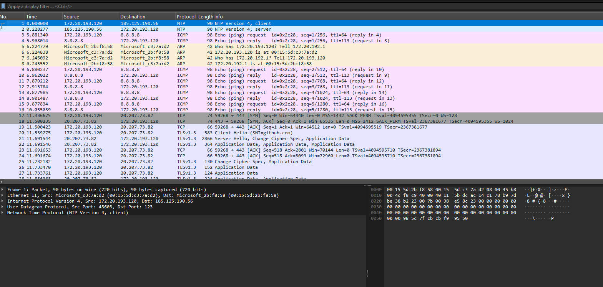

# Lab 03 — Packet Capture Basics

## What This Lab Covers

Up to this point, the network state has been observed through
configuration: interfaces, addresses, routes, sockets. None of that
involved actual traffic.

This lab introduces tcpdump — the tool that captures live traffic
as it moves through a network interface. The output is then opened
in Wireshark for visual inspection.

By the end, the mechanics of capturing traffic, filtering it, and
reading basic output will feel routine.

---

## Prerequisites

Lab 02 completed. The three baseline commands (`ip addr`, `ip route`,
`ss -tulnp`) are understood. All tools installed.

---

## How tcpdump Works

tcpdump attaches to a network interface and reads every frame that
passes through it — both inbound and outbound. Think of it as placing
a camera on the network cable: it records everything without interfering
with the traffic itself.

```
Internet ──► eth0 ──► [ tcpdump reads here ] ──► applications
                               │
                               ▼
                          terminal output
                          or .pcap file
```

By default it prints a summary line for each packet. With the right
flags it writes raw bytes to a file that Wireshark can open and
display visually.

---

## Capturing Live Traffic

### Starting the first capture

```bash
sudo tcpdump -i eth0 -c 20
```

`-i eth0` tells tcpdump which interface to listen on.
`-c 20` stops automatically after 20 packets.

With the capture running, open a second terminal and generate traffic:

```bash
ping -c 5 8.8.8.8
```

Switch back to the first terminal and observe the output.

```
tcpdump: verbose output suppressed, use -v[v]... for full protocol decode
listening on eth0, link-type EN10MB (Ethernet), snapshot length 262144 bytes
16:08:37.933797 ARP, Request who-has 172.20.193.120 (00:15:5d:c3:7a:d2 (oui Unknown)) tell DESKTOP-11LCHAP.mshome.net, length 28
16:08:37.933851 ARP, Reply 172.20.193.120 is-at 00:15:5d:c3:7a:d2 (oui Unknown), length 28
16:08:38.344601 ARP, Request who-has DESKTOP-11LCHAP.mshome.net tell 172.20.193.120, length 28
16:08:38.344823 ARP, Reply DESKTOP-11LCHAP.mshome.net is-at 00:15:5d:2b:f8:58 (oui Unknown), length 28
16:08:52.098442 IP 172.20.193.120 > dns.google: ICMP echo request, id 9070, seq 1, length 64
16:08:52.121252 IP dns.google > 172.20.193.120: ICMP echo reply, id 9070, seq 1, length 64
16:08:53.097925 IP 172.20.193.120 > dns.google: ICMP echo request, id 9070, seq 2, length 64
16:08:53.144512 IP dns.google > 172.20.193.120: ICMP echo reply, id 9070, seq 2, length 64
16:08:54.095547 IP 172.20.193.120 > dns.google: ICMP echo request, id 9070, seq 3, length 64
16:08:54.125958 IP dns.google > 172.20.193.120: ICMP echo reply, id 9070, seq 3, length 64
16:08:55.094811 IP 172.20.193.120 > dns.google: ICMP echo request, id 9070, seq 4, length 64
16:08:55.129058 IP dns.google > 172.20.193.120: ICMP echo reply, id 9070, seq 4, length 64
16:08:56.095517 IP 172.20.193.120 > dns.google: ICMP echo request, id 9070, seq 5, length 64
16:08:56.185200 IP dns.google > 172.20.193.120: ICMP echo reply, id 9070, seq 5, length 64
16:08:59.879707 ARP, Request who-has 172.20.193.120 (00:15:5d:c3:7a:d2 (oui Unknown)) tell DESKTOP-11LCHAP.mshome.net, length 28
16:08:59.879728 ARP, Reply 172.20.193.120 is-at 00:15:5d:c3:7a:d2 (oui Unknown), length 28
16:09:05.410307 IP 172.20.193.120.39343 > prod-ntp-3.ntp4.ps5.canonical.com.ntp: NTPv4, Client, length 48
16:09:05.529806 IP prod-ntp-3.ntp4.ps5.canonical.com.ntp > 172.20.193.120.39343: NTPv4, Server, length 48
16:09:38.666081 IP 172.20.193.120.49686 > prod-ntp-3.ntp4.ps5.canonical.com.ntp: NTPv4, Client, length 48
16:09:38.882069 IP prod-ntp-3.ntp4.ps5.canonical.com.ntp > 172.20.193.120.49686: NTPv4, Server, length 48
20 packets captured
20 packets received by filter
0 packets dropped by kernel
```

---

### Reading a summary line

A typical line looks like this:

```
16:08:53.097925 IP 172.20.193.120 > dns.google: ICMP echo request, id 9070, seq 2, length 64
16:08:53.144512 IP dns.google > 172.20.193.120: ICMP echo reply, id 9070, seq 2, length 64
```

Each field has a specific meaning:

| Field | Meaning |
|---|---|
| `16:08:53.097925` | Timestamp — hours:minutes:seconds.microseconds |
| `IP` | Layer 3 protocol — this is an IPv4 packet |
| `172.20.193.120` | Source IP address |
| `>` | Direction of traffic |
| `8.8.8.8` | Destination IP address |
| `ICMP echo request` | What type of packet this is |
| `length 64` | Packet payload size in bytes |

The pair of lines above shows the complete round trip: an ICMP echo
request leaving the machine, and the reply arriving back. This is
exactly one ping.

---

## Filtering Traffic

Capturing everything on a busy interface produces too much output to
read. Filters narrow the capture to what is relevant.

### Filter by protocol

```bash
sudo tcpdump -i eth0 icmp
```

Generate ping traffic in a second terminal:

```bash
ping -c 3 8.8.8.8
```

```
tcpdump: verbose output suppressed, use -v[v]... for full protocol decode
listening on eth0, link-type EN10MB (Ethernet), snapshot length 262144 bytes
16:14:52.304300 IP 172.20.193.120 > dns.google: ICMP echo request, id 9928, seq 1, length 64
16:14:52.330258 IP dns.google > 172.20.193.120: ICMP echo reply, id 9928, seq 1, length 64
16:14:53.303290 IP 172.20.193.120 > dns.google: ICMP echo request, id 9928, seq 2, length 64
16:14:53.325874 IP dns.google > 172.20.193.120: ICMP echo reply, id 9928, seq 2, length 64
16:14:54.304148 IP 172.20.193.120 > dns.google: ICMP echo request, id 9928, seq 3, length 64
16:14:54.406330 IP dns.google > 172.20.193.120: ICMP echo reply, id 9928, seq 3, length 64
```

Only ICMP packets appear. TCP, UDP, and ARP traffic is ignored.

---

```bash
sudo tcpdump -i eth0 udp
```

Generate DNS traffic in a second terminal:

```bash
dig google.com
```

```
16:15:44.235198 IP 172.20.193.120.45951 > prod-ntp-3.ntp1.ps5.canonical.com.ntp: NTPv4, Client, length 48
16:15:44.365746 IP prod-ntp-3.ntp1.ps5.canonical.com.ntp > 172.20.193.120.45951: NTPv4, Server, length 48
```

This filter captures all UDP traffic, not only DNS.

In this capture, background NTP traffic appeared because NTP also uses UDP.

The DNS query did not appear here, which is normal in some environments. It may be cached, handled by WSL2 DNS forwarding, or resolved through a path not visible on this interface.

The important point: tcpdump shows real traffic on the selected interface, not what we expected to happen theoretically.

---

### Filter by host

```bash
sudo tcpdump -i eth0 host 8.8.8.8
```

This captures any traffic — regardless of protocol — where the source
or destination is `8.8.8.8`. Useful when investigating traffic to or
from a specific server.

```bash
ping -c 3 8.8.8.8
```

```
tcpdump: verbose output suppressed, use -v[v]... for full protocol decode
listening on eth0, link-type EN10MB (Ethernet), snapshot length 262144 bytes
16:16:52.742189 IP 172.20.193.120 > dns.google: ICMP echo request, id 10430, seq 1, length 64
16:16:52.764082 IP dns.google > 172.20.193.120: ICMP echo reply, id 10430, seq 1, length 64
16:16:53.743882 IP 172.20.193.120 > dns.google: ICMP echo request, id 10430, seq 2, length 64
16:16:53.770585 IP dns.google > 172.20.193.120: ICMP echo reply, id 10430, seq 2, length 64
16:16:54.744898 IP 172.20.193.120 > dns.google: ICMP echo request, id 10430, seq 3, length 64
16:16:54.797875 IP dns.google > 172.20.193.120: ICMP echo reply, id 10430, seq 3, length 64
```

---

### Filter by port

```bash
sudo tcpdump -i eth0 port 53
```

Port 53 is DNS. This filter captures only DNS traffic, regardless of
whether it is TCP or UDP.

```bash
dig github.com
```

```
Nothing appeared here
```

In this capture, no DNS packets appeared even though `dig github.com` was executed.

This means no visible port 53 traffic crossed `eth0` during the capture window.

Possible reasons:
- the answer was already cached
- WSL2 handled DNS forwarding internally
- the query used another path or interface

This is an important packet-capture lesson: absence of output is also evidence. It means the expected traffic was not observed on the selected interface.

---

### Combining filters

Filters can be combined with `and`, `or`, and `not`:

```bash
# Only TCP traffic to port 443
sudo tcpdump -i eth0 tcp and port 443

# Traffic to or from 8.8.8.8 but not ICMP
sudo tcpdump -i eth0 host 8.8.8.8 and not icmp
```

---

## Saving to a File

The terminal output is useful for quick inspection. For deeper analysis,
the capture is saved to a `.pcap` file and opened in Wireshark.

```bash
sudo tcpdump -i eth0 -w captures/lab-03-first-capture.pcap
```

tcpdump runs silently — no output appears in the terminal while writing
to a file. Generate some traffic:

```bash
ping -c 5 8.8.8.8
curl -s https://github.com > /dev/null
dig google.com
```

Stop the capture with `Ctrl+C`. The file is now in the `captures/`
directory.

```bash
ls -lh captures/
```

```
-rw-r--r-- 1 tcpdump tcpdump 603K May 19 16:21 lab-03-first-capture.pcap
```

---

## Opening in Wireshark

Transfer the `.pcap` file to Windows if needed, then open it in Wireshark.
Alternatively, start Wireshark on Windows and capture directly from the
`vEthernet (WSL)` adapter while running the same traffic commands above.

### The three panels

A real capture looks like this:

```

```

**Packet List** — every captured packet as a row. Click any row to
select it.

**Packet Details** — the selected packet expanded into its protocol
layers. Each layer can be expanded further to see individual fields.
This is where the encapsulation from Lab 00 becomes visible.

Ethernet wraps IP. IP then wraps protocols like:
- ICMP
- TCP
- UDP

Higher-level protocols like DNS, TLS, HTTP, or NTP sit inside those layers.

**Packet Bytes** — the raw bytes of the selected packet in hex on the
left and ASCII on the right. Clicking a field in the Details panel
highlights the corresponding bytes here.

---

### Navigating the capture

In the filter bar at the top, type `icmp` and press Enter. Only ICMP
packets remain visible. Clear the filter and type `dns` — only DNS
traffic appears.

Click one ICMP packet in the Packet List. In the Packet Details panel,
expand each layer:

- **Frame** — Wireshark capture metadata (timestamps, packet size, capture details)
- **Ethernet II** — Layer 2 Ethernet header and MAC addresses
- **Internet Protocol** — Layer 3 source and destination IP addresses
- **TCP / UDP / ICMP** — Layer 4 transport or control protocol
- **Application Protocol** — higher-level protocol like DNS, HTTP, TLS, or NTP

The structure matches the encapsulation diagram from Lab 00. The frame
is the outermost wrapper. IP is inside it. ICMP is inside IP.

---

### Using tshark inside WSL2

tshark is the terminal equivalent of Wireshark. It reads `.pcap` files
and applies display filters without leaving the terminal:

```bash
tshark -r captures/lab-03-first-capture.pcap
```

```
  1   0.000000 172.20.193.120 → 185.125.190.56 NTP 90 NTP Version 4, client
    2   0.228277 185.125.190.56 → 172.20.193.120 NTP 90 NTP Version 4, server
    3   5.881340 172.20.193.120 → 8.8.8.8      ICMP 98 Echo (ping) request  id=0x2c28, seq=1/256, ttl=64
    4   5.968014      8.8.8.8 → 172.20.193.120 ICMP 98 Echo (ping) reply    id=0x2c28, seq=1/256, ttl=113 (request in 3)
    5   6.224779 Microsoft_2b:f8:58 → Microsoft_c3:7a:d2 ARP 42 Who has 172.20.193.120? Tell 172.20.192.1
    6   6.224838 Microsoft_c3:7a:d2 → Microsoft_2b:f8:58 ARP 42 172.20.193.120 is at 00:15:5d:c3:7a:d2
    7   6.245092 Microsoft_c3:7a:d2 → Microsoft_2b:f8:58 ARP 42 Who has 172.20.192.1? Tell 172.20.193.120
    8   6.245552 Microsoft_2b:f8:58 → Microsoft_c3:7a:d2 ARP 42 172.20.192.1 is at 00:15:5d:2b:f8:58
    9   6.880237 172.20.193.120 → 8.8.8.8      ICMP 98 Echo (ping) request  id=0x2c28, seq=2/512, ttl=64
   10   6.962022      8.8.8.8 → 172.20.193.120 ICMP 98 Echo (ping) reply    id=0x2c28, seq=2/512, ttl=113 (request in 9)
   ......
   322  12.694282 172.20.193.120 → 20.207.73.82 TCP 66 59268 → 443 [ACK] Seq=757 Ack=585119 Win=1034880 Len=0 TSval=4094596713 TSecr=2367382981
  323  12.694479 20.207.73.82 → 172.20.193.120 TLSv1.3 1466 Application Data
  324  12.694484 20.207.73.82 → 172.20.193.120 TLSv1.3 2308 Application Data, Application Data, Application Data
  325  12.694534 172.20.193.120 → 20.207.73.82 TCP 66 59268 → 443 [ACK] Seq=757 Ack=588761 Win=1042176 Len=0 TSval=4094596713 TSecr=2367382981
  326  12.695022 172.20.193.120 → 20.207.73.82 TLSv1.3 90 Application Data
  327  12.696817 172.20.193.120 → 20.207.73.82 TCP 66 59268 → 443 [FIN, ACK] Seq=781 Ack=588761 Win=1042176 Len=0 TSval=4094596715 TSecr=2367382981
  328  12.818656 20.207.73.82 → 172.20.193.120 TCP 66 443 → 59268 [ACK] Seq=588761 Ack=781 Win=67584 Len=0 TSval=2367383118 TSecr=4094596714
  329  12.825662 20.207.73.82 → 172.20.193.120 TLSv1.3 90 Application Data
  330  12.825663 20.207.73.82 → 172.20.193.120 TCP 66 443 → 59268 [FIN, ACK] Seq=588785 Ack=782 Win=67584 Len=0 TSval=2367383123 TSecr=4094596715
  331  12.825722 172.20.193.120 → 20.207.73.82 TCP 54 59268 → 443 [RST] Seq=782 Win=0 Len=0
  332  12.825743 172.20.193.120 → 20.207.73.82 TCP 54 59268 → 443 [RST] Seq=782 Win=0 Len=0
   ```

```bash
# Filter to DNS only
tshark -r captures/lab-03-first-capture.pcap -Y dns
```

```
Empty
```
The DNS display filter returned nothing because this capture did not contain visible DNS packets.

That does not mean DNS was not used by the system at all. It only means DNS packets were not present in this specific `.pcap` file.

Packet analysis always depends on:
- selected interface
- capture timing
- filters used
- resolver behavior


tshark becomes useful in later labs when analysing captures on remote
servers where Wireshark is not available.

---

## What This Established

tcpdump and Wireshark are now part of the working toolkit. The
mechanics of capture — attaching to an interface, filtering by
protocol or host, saving to a file, opening in Wireshark are
operational from this point forward.

Every lab from here introduces tcpdump alongside the primary tool
being studied. The captures will become progressively more detailed
as the protocols being analysed become more complex.

The next lab examines the structure of Ethernet frames — the outer
layer of every packet captured here.

---


*Next: Lab 04 — Ethernet Frames and Packet Structure*
*The captured packets are examined at the frame level — MAC addresses,*
*EtherType, and how protocol layers nest inside each other.*