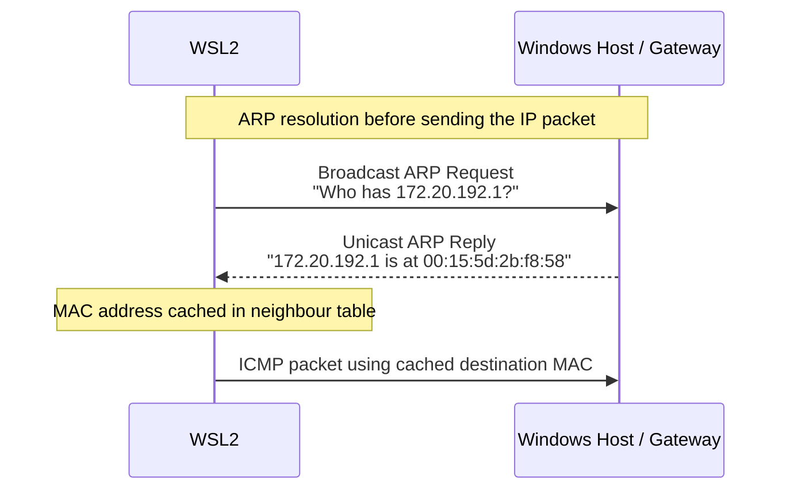
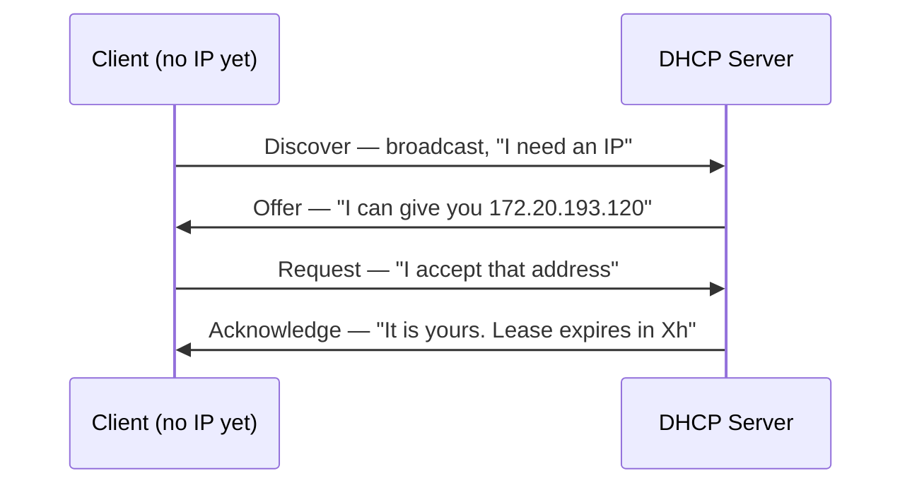
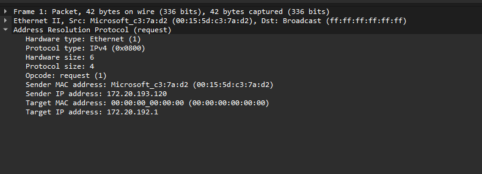

# Lab 05 — ARP and Local Networking

## What This Lab Covers

Lab 04 introduced ARP as a side effect of examining Ethernet frames.
This lab examines it directly.

ARP is the mechanism that bridges Layer 3 (IP addresses) and Layer 2
(MAC addresses). Before any IP packet can leave a machine on a local
network, the sender must know the MAC address of the next hop on the
local segment. ARP finds
it. On IPv4 Ethernet networks, ARP is normally how a machine discovers the
MAC address associated with a local IP address before communication can begin.

DHCP is covered briefly at the end — the protocol that assigns IP
addresses in the first place, before ARP has anything to work with.

---

## Prerequisites

Lab 04 completed. ARP packets were captured and observed. The ARP
table (`ip neighbor show`) was checked after flushing the cache.

---

## The ARP Cache

ARP results are cached to avoid broadcasting a request before every
single packet. The cache stores IP-to-MAC mappings with a state that
reflects how recently each entry was confirmed.

```bash
ip neighbor show
```

```
172.20.192.1 dev eth0 lladdr 00:15:5d:2b:f8:58 REACHABLE 
```

Each line is one cached mapping:

```
172.20.192.1 dev eth0 lladdr 00:15:5d:2b:f8:58 REACHABLE
```

| Field | Meaning |
|---|---|
| `172.20.192.1` | IP address of the neighbour |
| `dev eth0` | Interface through which it is reachable |
| `lladdr 00:15:5d:2b:f8:58` | Resolved MAC address |
| `REACHABLE` | Cache state |

---

### Cache States

The state field reflects how confident the kernel is in the cached entry:

| State | Meaning |
|---|---|
| `REACHABLE` | Recently confirmed — entry is trusted |
| `STALE` | Not recently confirmed — still usable, but kernel will re-verify |
| `DELAY` | Transitioning — kernel sent a probe, waiting for reply |
| `PROBE` | Actively sending ARP requests to re-confirm |
| `FAILED` | ARP requests sent, no reply received |
| `PERMANENT` | Manually configured — never expires |

In normal operation, entries cycle between `REACHABLE` and `STALE` as
the kernel periodically re-verifies active neighbours. `FAILED` appears
when a host is unreachable or does not exist and is the first indicator
to check when diagnosing "host unreachable" failures on a local network.

---

## Watching the ARP Cycle

Flushing the cache removes all current entries. The next packet to a
known IP triggers a fresh ARP exchange.

```bash
sudo ip neighbor flush all
ip neigh show
```

```
Empty
```
On quiet systems the table may become empty briefly.

In active environments like WSL2, background traffic often causes the
gateway entry to reappear immediately after the flush. This is normal.
The kernel rebuilds neighbour entries automatically whenever traffic
needs to leave the interface again.

With an empty cache, send one ping:

```bash
ping -c 1 8.8.8.8
```

Immediately check the cache:

```bash
ip neigh show
```

```
172.20.192.1 dev eth0 lladdr 00:15:5d:2b:f8:58 REACHABLE 
```

One or more neighbour entries appeared again. Before the ICMP packet
could leave the interface, the kernel needed a destination MAC address
for the next hop. That triggered a fresh ARP exchange automatically.

This usually happens extremely quickly — often fast enough that the ARP
request and reply are never noticed unless traffic is being captured at
the same time.

Run the same check again after some time. Active entries usually begin
in the `REACHABLE` state, then transition to states like `STALE` as the
kernel ages the neighbour information.

---

## The ARP Exchange in Detail

```bash
sudo tcpdump -i eth0 -e arp &
sudo ip neigh flush all
ping -c 2 8.8.8.8
```

```
13:55:23.392621 00:15:5d:c3:7a:d2 (oui Unknown) > Broadcast, ethertype ARP (0x0806), length 42: Request who-has DESKTOP-11LCHAP.mshome.net tell 172.20.193.120, length 28
13:55:23.392794 00:15:5d:2b:f8:58 (oui Unknown) > 00:15:5d:c3:7a:d2 (oui Unknown), ethertype ARP (0x0806), length 42: Reply DESKTOP-11LCHAP.mshome.net is-at 00:15:5d:2b:f8:58 (oui Unknown), length 28
```

Stop the background tcpdump:
```bash
sudo pkill tcpdump
```

A normal ARP exchange contains two messages:



The request is a broadcast — it reaches every device on the local
segment. Only the device that owns the requested IP replies. All
other devices on the segment receive the request and silently discard it.

The reply is unicast — sent directly to the requester's MAC address.
After this exchange, the IP-to-MAC mapping is stored in the neighbour
table. Future packets can reuse the cached MAC address without another
ARP request until the entry ages out or becomes invalid.

Notice that ARP is not resolving the MAC address of `8.8.8.8`.

ARP only resolves the MAC address of the next hop on the local network
— in this case, the default gateway (`172.20.192.1`).

The Ethernet frame is delivered locally to the gateway router. The router
then forwards the IP packet toward the internet.

---

## When ARP Fails

Attempting to reach an IP that does not exist on the local network
produces a failed ARP entry. This is the Layer 2 equivalent of a
routing failure — the packet has nowhere to go at the frame level.

```bash
sudo ip neigh flush all
ping -c 2 -W 1 172.20.193.250
```

```
PING 172.20.193.250 (172.20.193.250) 56(84) bytes of data.

--- 172.20.193.250 ping statistics ---
2 packets transmitted, 0 received, 100% packet loss, time 1018ms
```

```bash
ip neighbor show
```

```
172.20.192.1 dev eth0 lladdr 00:15:5d:2b:f8:58 REACHABLE 
172.20.193.250 dev eth0 FAILED 
```

A `FAILED` entry appears for `172.20.193.250`. The kernel sent ARP
requests and received no response — the address does not exist on this
segment. The ping packets were never transmitted because no MAC address
was available to address the frames.

From the application's perspective, the connection simply hangs or
times out. The real failure is happening lower in the stack — the
kernel never learned the destination MAC address needed to build the
Ethernet frame. Checking `ip neighbor show` for `FAILED`
entries is the correct diagnostic step when a host on the same subnet
is unreachable.

Clean up:
```bash
sudo ip neighbor del 172.20.193.250 dev eth0 2>/dev/null; true
```

---

## Manually Inspecting a Specific Neighbour

```bash
ip neighbor show dev eth0
```

```
172.20.192.1 lladdr 00:15:5d:2b:f8:58 REACHABLE 
```

```bash
# Show only the gateway entry
ip neighbor show 172.20.192.1
```

```
172.20.192.1 dev eth0 lladdr 00:15:5d:2b:f8:58 REACHABLE 
```

This is useful in scripts and debugging sessions when checking whether
a specific host has been resolved without reading through the entire
neighbour table.

---

## DHCP — Where the IP Address Came From

Before ARP can resolve anything, this machine needs an IP address.
DHCP (Dynamic Host Configuration Protocol) provides it.

DHCP follows a four-step exchange called DORA:



Along with the IP address, the Acknowledge message delivers:
- **Subnet mask** — defines the local network range
- **Default gateway** — where to send non-local traffic
- **DNS server** — where to resolve hostnames
- **Lease duration** — how long the address is valid

This is why `ip addr`, `ip route`, and `/etc/resolv.conf` all show
consistent values — they were all populated from a single DHCP response.

---

### Reading DHCP's Output in WSL2

WSL2 networking runs inside a Hyper-V virtual network environment.

The DHCP exchange happens during virtual interface initialization,
before the Linux guest can normally capture packets with tools like
tcpdump. Because of this, directly capturing the DORA exchange from
inside WSL2 is usually not possible.


The result of DHCP is readable from the configuration it applied:

```bash
# The IP address DHCP assigned
ip addr show eth0 | grep inet

# The gateway DHCP provided
ip route show default

# The DNS server DHCP specified
cat /etc/resolv.conf
```

```
  inet 172.20.193.120/20 brd 172.20.207.255 scope global eth0
    inet6 fe80::215:5dff:fec3:7ad2/64 scope link 

  default via 172.20.192.1 dev eth0 proto kernel 

  # This file was automatically generated by WSL. To stop automatic generation of this file, add the following entry to /etc/wsl.conf:
  # [network]
  # generateResolvConf = false
  nameserver 10.255.255.254  
```

These commands reveal the network configuration DHCP negotiated during
startup:
- the assigned IP address
- the default gateway
- the DNS resolver

The DHCP server provides this information during the DORA exchange when
the WSL2 virtual network interface initializes.

Without DHCP, the interface would not automatically know:
- its IP address
- its subnet
- where the gateway is
- which DNS server to use

All higher-level networking depends on this initial configuration step.


---

### DHCP on Real Linux Systems

On a bare-metal Linux machine or an EC2 instance, the DHCP exchange
is visible with:

```bash
sudo tcpdump -i eth0 port 67 or port 68
```

DHCP uses UDP. The client broadcasts from port 68 to port 67. The
server responds from port 67 to port 68. The full DORA exchange
appears as four UDP packets.

On EC2, DHCP is how instances receive their private IP, VPC gateway,
and DNS resolver at boot. The same four-step exchange, the same ports,
the same result — just with AWS infrastructure as the DHCP server.

---

## Saving This Capture

```bash
sudo tcpdump -i eth0 -e -w captures/lab-05-arp.pcap arp
```

In a second terminal:
```bash
sudo ip neigh flush all
ping -c 5 8.8.8.8
```

Stop the capture. Open it in Wireshark and expand the **ARP** layer
on a request packet. A real ARP request in Wireshark looks like this:



The ARP packet exposes both Layer 2 and Layer 3 information together:

- **Sender MAC address** — the MAC address of the machine sending the request
- **Sender IP address** — the IP address of the sender
- **Target IP address** — the IP address being searched for
- **Target MAC address** — unknown during the request, so it appears as `00:00:00:00:00:00`

Notice that the Ethernet destination address is:

`ff:ff:ff:ff:ff:ff`

This is the Layer 2 broadcast address. The ARP request is sent to every
device on the local network segment because the sender does not yet know
which MAC address owns the target IP.

The target MAC is zero in the request because discovering that MAC
address is the entire purpose of the ARP exchange. The reply fills in
the real MAC address.

---

## What This Established

ARP is the resolution layer between IP addresses and MAC addresses.
Every IP packet sent on a local Ethernet network requires a valid ARP
cache entry — if one does not exist, ARP runs first. If ARP fails,
the packet is silently dropped at Layer 2.

The cache states (`REACHABLE`, `STALE`, `FAILED`) reflect the current
reliability of each mapping. `FAILED` entries identify hosts that are
unreachable at Layer 2 — a diagnostic signal that sits below the
visibility of most higher-layer tools.

DHCP provides the initial configuration — IP, gateway, DNS — that
makes ARP and everything above it possible.

Phase 3 moves to the IP layer. The concepts built here — local vs
routed traffic, ARP for local resolution, default gateway for
everything else — are the foundation of every routing decision.


---

*Next: Lab 06 — IP Addressing and Subnetting*
*Phase 3 begins. IP addresses, subnet prefixes, and the CIDR notation*
*seen throughout the previous labs are examined in full.*