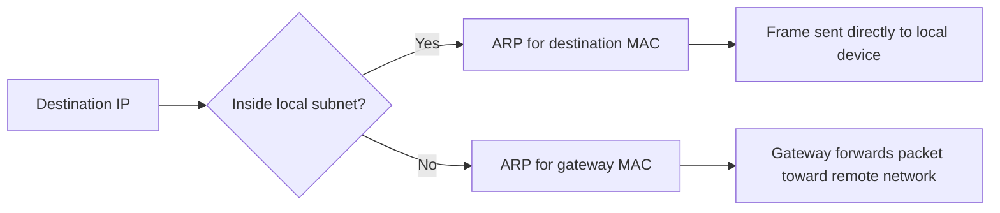

# Lab 06 — IP Addressing and Subnetting

## What This Lab Covers

Since Lab 02, IP addresses and subnet prefixes have appeared in nearly
every output — `172.20.193.120/20`, `172.17.0.0/16`, `172.20.192.0/20`.
The notation was read without explanation. This lab resolves that.

An IP address is a 32-bit number. The prefix length (the `/20` part)
divides that number into two portions: a network portion and a host
portion. The network portion identifies which subnet a device is on.
The host portion identifies which specific device within that subnet.

Understanding this is prerequisite to reading route tables, designing
VPC subnets in AWS, understanding Kubernetes pod CIDRs, and diagnosing
routing failures.

---

## Prerequisites

Lab 05 completed. The ARP cache, neighbour states, and DHCP-provided
configuration are understood. The values from `ip addr` and `ip route`
are familiar from earlier labs.

---

## IP Address Structure

An IPv4 address is 32 bits written as four decimal numbers separated by
dots. Each number represents 8 bits and ranges from 0 to 255.


```
192.168.1.100

11000000 . 10101000 . 00000001 . 01100100
   192         168         1         100
```

The prefix length splits those 32 bits into two parts:

```
192.168.1.100/24

|─────── Network (24 bits) ──────|── Host (8 bits) ──|
    192    .   168    .    1      .       100

Network bits → fixed, same for all devices on this subnet
Host bits    → variable, unique per device on this subnet
```

A `/24` means the first 24 bits are the network portion. All devices
sharing those 24 bits are on the same subnet — they can reach each
other directly without a router.

A `/16` means only the first 16 bits are fixed. More host bits means
more addresses in the range.

```
/8  → 8 network bits,  24 host bits → 16,777,214 usable addresses
/16 → 16 network bits, 16 host bits →     65,534 usable addresses
/24 → 24 network bits,  8 host bits →        254 usable addresses
/32 → 32 network bits,  0 host bits →          1 address (host route)
```

---

## Calculating a Subnet Range

Three addresses define any subnet:

| Address | Definition | Example (/24) |
|---|---|---|
| Network address | All host bits set to 0 | 192.168.1.0 |
| Broadcast address | All host bits set to 1 | 192.168.1.255 |
| Usable range | Everything between | 192.168.1.1 – 192.168.1.254 |

The network address and broadcast address cannot be assigned to devices.
Usable hosts = 2^(host bits) - 2.

---

## Using ipcalc

Manual subnet calculation is error-prone. `ipcalc` performs the
calculation and outputs the result in a readable format.

Start with the actual WSL2 IP address seen throughout these labs:

```bash
ipcalc 172.20.193.120/20
```

```
Address:   172.20.193.120       10101100.00010100.1100 0001.01111000
Netmask:   255.255.240.0 = 20   11111111.11111111.1111 0000.00000000
Wildcard:  0.0.15.255           00000000.00000000.0000 1111.11111111
=>
Network:   172.20.192.0/20      10101100.00010100.1100 0000.00000000
HostMin:   172.20.192.1         10101100.00010100.1100 0000.00000001
HostMax:   172.20.207.254       10101100.00010100.1100 1111.11111110
Broadcast: 172.20.207.255       10101100.00010100.1100 1111.11111111
Hosts/Net: 4094                  Class B, Private Internet
```

The output breaks down the `/20` that has appeared in every `ip addr`
output since Lab 02. The network address (`172.20.192.0`), broadcast
(`172.20.207.255`), and range match exactly what `ip addr` showed
under `brd`.

Try the same with Docker's subnet:

```bash
ipcalc 172.17.0.0/16
```

```
Address:   172.17.0.0           10101100.00010001. 00000000.00000000
Netmask:   255.255.0.0 = 16     11111111.11111111. 00000000.00000000
Wildcard:  0.0.255.255          00000000.00000000. 11111111.11111111
=>
Network:   172.17.0.0/16        10101100.00010001. 00000000.00000000
HostMin:   172.17.0.1           10101100.00010001. 00000000.00000001
HostMax:   172.17.255.254       10101100.00010001. 11111111.11111110
Broadcast: 172.17.255.255       10101100.00010001. 11111111.11111111
Hosts/Net: 65534                 Class B, Private Internet
```

Docker chose `/16` for its default bridge network — 65,534 addresses
available for containers. This is why the docker0 interface showed
`172.17.0.1/16` in Lab 02.

---

## Private IP Ranges

Three address ranges are reserved for private networks (RFC 1918).
Packets sourced from these addresses are not routed on the public
internet — they exist only within private networks.

| Range | Prefix | Total Addresses | Common Use |
|---|---|---|---|
| 10.0.0.0 – 10.255.255.255 | 10.0.0.0/8 | ~16 million | AWS VPCs, large enterprise |
| 172.16.0.0 – 172.31.255.255 | 172.16.0.0/12 | ~1 million | Docker, WSL2 |
| 192.168.0.0 – 192.168.255.255 | 192.168.0.0/16 | ~65,000 | Home networks |

All three ranges have appeared across these labs without explanation:

- `172.20.193.120` — WSL2 instance IP, inside `172.16.0.0/12`
- `172.17.0.1` — Docker bridge, also inside `172.16.0.0/12`
- `10.255.255.254` — WSL2 internal DNS forwarder, inside `10.0.0.0/8`

AWS VPCs default to `172.31.0.0/16` ranges. Kubernetes pod CIDRs
commonly use `10.244.0.0/16` or `192.168.0.0/16`. These choices
are private ranges specifically because the addresses do not conflict
with public internet routing.

Verify that the current IP falls within a private range:

```bash
ipcalc 172.20.193.120/20 | grep -E "Network|HostMin|HostMax"
```

```
Network:   172.20.192.0/20      10101100.00010100.1100 0000.00000000
HostMin:   172.20.192.1         10101100.00010100.1100 0000.00000001
HostMax:   172.20.207.254       10101100.00010100.1100 1111.11111110
```

---

## Reading Interface Addressing With Full Understanding

The `ip addr` output from Lab 02 can now be read completely:

```bash
ip addr show eth0
```

```
2: eth0: <BROADCAST,MULTICAST,UP,LOWER_UP> mtu 1500 qdisc mq state UP group default qlen 1000
    link/ether 00:15:5d:c3:7a:d2 brd ff:ff:ff:ff:ff:ff
    inet 172.20.193.120/20 brd 172.20.207.255 scope global eth0
       valid_lft forever preferred_lft forever
    inet6 fe80::215:5dff:fec3:7ad2/64 scope link 
       valid_lft forever preferred_lft forever
```

Every field now has meaning:

```
inet 172.20.193.120/20 brd 172.20.207.255 scope global eth0
```

- `172.20.193.120` — this device's IP address on the subnet
- `/20` — the subnet uses 20 network bits and 12 host bits
- `brd 172.20.207.255` — all-ones in the 12 host bits; confirmed by ipcalc
- `scope global` — routable, not loopback or link-local

The same reading applies to docker0:

```bash
ip addr show docker0
```

```
3: docker0: <NO-CARRIER,BROADCAST,MULTICAST,UP> mtu 1500 qdisc noqueue state DOWN group default 
    link/ether 22:ce:9e:1a:d9:3d brd ff:ff:ff:ff:ff:ff
    inet 172.17.0.1/16 brd 172.17.255.255 scope global docker0
       valid_lft forever preferred_lft forever
```

`172.17.0.1/16` — Docker holds `.0.1` (the first usable host address)
as the bridge gateway. Containers are assigned addresses from `.0.2`
upward within that /16.

---

## Adding and Removing IP Addresses

IP addresses are kernel configuration. They can be added to and removed
from interfaces at runtime without restarting anything.

```bash
# Add a secondary address to eth0
sudo ip addr add 10.99.0.1/24 dev eth0

# Verify it appeared
ip addr show eth0 | grep inet
```

```
inet 172.20.193.120/20 brd 172.20.207.255 scope global eth0
inet 10.99.0.1/24 scope global eth0
inet6 fe80::215:5dff:fec3:7ad2/64 scope link 
```

```bash
# Check what ipcalc says about this new subnet
ipcalc 10.99.0.1/24
```

```
Address:   10.99.0.1            00001010.01100011.00000000. 00000001
Netmask:   255.255.255.0 = 24   11111111.11111111.11111111. 00000000
Wildcard:  0.0.0.255            00000000.00000000.00000000. 11111111
=>
Network:   10.99.0.0/24         00001010.01100011.00000000. 00000000
HostMin:   10.99.0.1            00001010.01100011.00000000. 00000001
HostMax:   10.99.0.254          00001010.01100011.00000000. 11111110
Broadcast: 10.99.0.255          00001010.01100011.00000000. 11111111
Hosts/Net: 254                   Class A, Private Internet
```

```bash
# Test reachability to the address itself
ping -c 2 10.99.0.1
```

```
PING 10.99.0.1 (10.99.0.1) 56(84) bytes of data.
64 bytes from 10.99.0.1: icmp_seq=1 ttl=64 time=0.422 ms
64 bytes from 10.99.0.1: icmp_seq=2 ttl=64 time=0.040 ms

--- 10.99.0.1 ping statistics ---
2 packets transmitted, 2 received, 0% packet loss, time 1030ms
rtt min/avg/max/mdev = 0.040/0.231/0.422/0.191 ms
```

The ping succeeds because `10.99.0.1` is now assigned to the local
machine itself. — traffic
destined for it routes to the loopback path, not eth0. This is how
cloud providers add Elastic IPs to EC2 instances and how Kubernetes
assigns addresses to pods — the same `ip addr add` at the kernel level.

Remove the address:

```bash
sudo ip addr del 10.99.0.1/24 dev eth0
ip addr show eth0 | grep inet
```

```
inet 172.20.193.120/20 brd 172.20.207.255 scope global eth0
inet6 fe80::215:5dff:fec3:7ad2/64 scope link 
```

The address disappears immediately. No restart, no service interruption
to other addresses on the same interface.

---

## How the Kernel Uses Subnet Information

The subnet prefix is not just notation — the kernel uses it to decide
whether a destination is local or remote.



```bash
# Destination on the same /20 subnet as eth0
ip route get 172.20.193.200
```

```
172.20.193.200 dev eth0 src 172.20.193.120 uid 1000 
    cache
```

```bash
# Destination outside the subnet
ip route get 8.8.8.8
```

```
8.8.8.8 via 172.20.192.1 dev eth0 src 172.20.193.120 uid 1000 
    cache 
```

The first query returns a route using `dev eth0` with no gateway — the
destination is within the local subnet, reachable directly via ARP.

The second returns the default route via `172.20.192.1` — the kernel
determined `8.8.8.8` is outside the local subnet and must be forwarded
to the gateway.

This decision — local or remote, direct or via gateway — is made by
comparing the destination IP against the subnet defined by the prefix
length. The same logic runs on every router in the path and on every
AWS route table evaluation.

---

## Two Subnets on One Interface

A single interface can hold multiple addresses from different subnets:

```bash
sudo ip addr add 10.10.0.1/24 dev eth0
sudo ip addr add 10.20.0.1/24 dev eth0
ip addr show eth0 | grep inet
```

```
inet 172.20.193.120/20 brd 172.20.207.255 scope global eth0
inet 10.10.0.1/24 scope global eth0
inet 10.20.0.1/24 scope global eth0
inet6 fe80::215:5dff:fec3:7ad2/64 scope link 
```

```bash
ip route show
```

```
default via 172.20.192.1 dev eth0 proto kernel 
10.10.0.0/24 dev eth0 proto kernel scope link src 10.10.0.1 
10.20.0.0/24 dev eth0 proto kernel scope link src 10.20.0.1 
172.17.0.0/16 dev docker0 proto kernel scope link src 172.17.0.1 linkdown 
172.20.192.0/20 dev eth0 proto kernel scope link src 172.20.193.120 
```

Both subnets appear as directly connected routes. Traffic to `10.10.0.x`
routes via eth0 without a gateway. Traffic to `10.20.0.x` does the same.
Traffic to anything else still uses the default gateway.

This pattern appears in AWS when multiple secondary CIDRs are added to
a VPC subnet, and in Kubernetes when a node hosts pods from multiple
IP pools.

Clean up:
```bash
sudo ip addr del 10.10.0.1/24 dev eth0
sudo ip addr del 10.20.0.1/24 dev eth0
```

---

## Summary Table

The subnets seen across these labs, now fully explained:

| Subnet | Where Seen | Size | Purpose |
|---|---|---|---|
| `172.20.192.0/20` | eth0, ip route | 4094 hosts | WSL2 virtual network |
| `172.17.0.0/16` | docker0, ip route | 65,534 hosts | Docker bridge |
| `10.255.255.254/32` | lo, ss output | 1 host | WSL2 DNS forwarder |
| `127.0.0.0/8` | lo | 16M (loopback) | Loopback range |


---

*Next: Lab 07 — IPv6 Basics*
*IPv6 addresses, link-local vs global scope, AAAA records, and*
*dual-stack behavior — enough to work confidently in environments*
*where IPv6 is present without it becoming a blocker.*