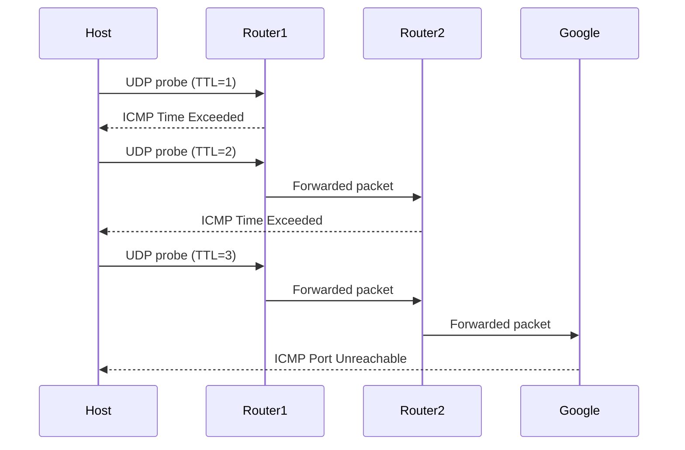
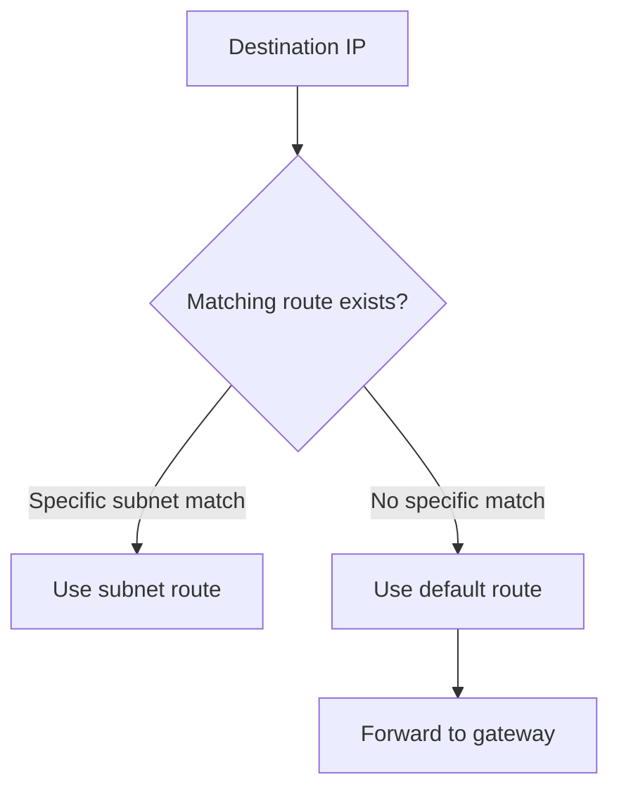
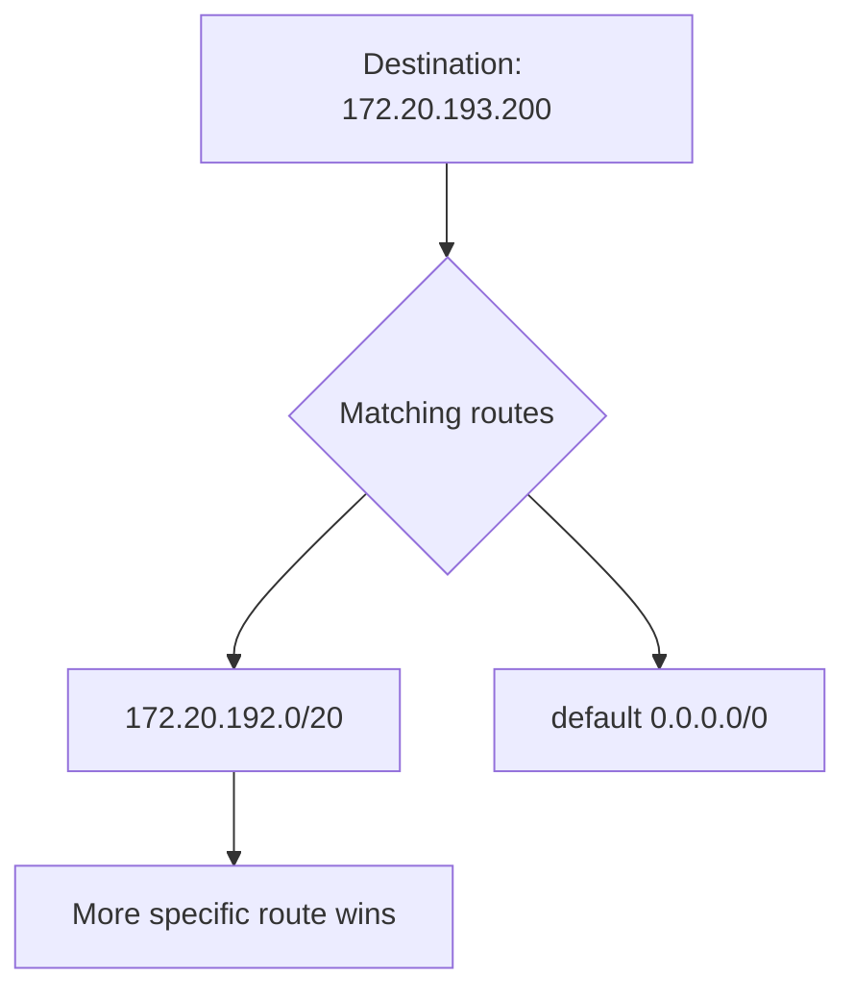
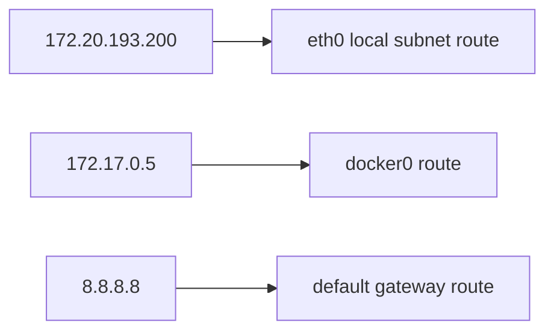

# Lab 08 — Routing, ICMP, and Traceroute

## What This Lab Covers

This lab covers three connected topics that together explain how
packets find their way across a network and how to investigate
that path when something goes wrong.

**Routing** — how the kernel decides where to send each packet.

**ICMP** — the protocol that carries error messages and diagnostics.
ping relies directly on ICMP, while traceroute relies on ICMP error
responses generated by routers along the path.

**Traceroute** — a tool that maps the path a packet takes across
multiple routers by exploiting how ICMP and TTL work together.

These three topics come up constantly in production debugging.

---

## Prerequisites

Lab 07 completed. Routing table has been seen in Labs 02 and 06.
IP addressing and subnets are understood.

---

## ICMP — The Network's Notification System

IP moves packets between networks based on IP addressing and routing. But IP has no built-in
way to report errors or test whether a path is working. That is what
ICMP (Internet Control Message Protocol) handles.

**The analogy:** ICMP is like the postal service's error notification
system. When something goes wrong with a delivery — the address does not
exist, the recipient is unreachable, the package has been held too long
— the postal service sends you a notification explaining what happened.
ICMP is that notification system for IP packets.

ICMP messages have types. Each type means something specific.

| Type | Name | What Triggered It |
|---|---|---|
| 0 | Echo Reply | "I received your ping and I'm responding" |
| 3 | Destination Unreachable | "I cannot deliver this packet" |
| 8 | Echo Request | "Are you reachable?" — the outgoing ping |
| 11 | Time Exceeded | "This packet's TTL hit zero — I dropped it" |

Every `ping` you have run so far sends Type 8 out and waits for
Type 0 back. Types 3 and 11 appear when things go wrong and
traceroute deliberately triggers Type 11.

Capture ICMP while running ping to see Types 8 and 0 together:

```bash
sudo tcpdump -i eth0 icmp -nn &
ping -c 3 8.8.8.8
sudo pkill tcpdump
```

```
listening on eth0, link-type EN10MB (Ethernet), snapshot length 262144 bytes
11:28:52.731903 IP 172.20.193.120 > 8.8.8.8: ICMP echo request, id 3780, seq 1, length 64
11:28:52.750675 IP 8.8.8.8 > 172.20.193.120: ICMP echo reply, id 3780, seq 1, length 64
11:28:53.731613 IP 172.20.193.120 > 8.8.8.8: ICMP echo request, id 3780, seq 2, length 64
11:28:53.750449 IP 8.8.8.8 > 172.20.193.120: ICMP echo reply, id 3780, seq 2, length 64
11:28:54.731642 IP 172.20.193.120 > 8.8.8.8: ICMP echo request, id 3780, seq 3, length 64
11:28:54.751306 IP 8.8.8.8 > 172.20.193.120: ICMP echo reply, id 3780, seq 3, length 64

6 packets captured
6 packets received by filter
0 packets dropped by kernel
```

In the capture, outgoing lines show `echo request` (Type 8) and
incoming lines show `echo reply` (Type 0). Each pair is one complete
ping round trip.

---

## TTL — Why Packets Don't Loop Forever

Every IP packet carries a field called TTL (Time to Live). It is
just a number — usually starting at 64 on Linux.

**The rule:** every router that forwards a packet decrements TTL
by 1. When TTL reaches 0, the router does not forward the packet.
Instead it drops it and sends an ICMP Type 11 "Time Exceeded"
message back to the original sender.

**Why this exists:** Without TTL, a misconfigured routing loop could
trap a packet forever — bouncing between two routers that each think
the next hop is the other one. TTL guarantees that any packet
eventually dies and does not circulate indefinitely.

**The analogy:** Imagine a package with a stamp on it saying "this
package may only change hands 64 times." Every courier who handles
it reduces that count by one. If it reaches zero before delivery,
that courier sends it back to the original sender with a note:
"Expired after too many hops — last seen at my location."

You can see TTL in every ping output you have already run:

```
64 bytes from 8.8.8.8: icmp_seq=1 ttl=115 time=25.8 ms
```

The `ttl=115` here is the TTL value in the *reply* packet from
`8.8.8.8` — not your outgoing packet. Google's servers set an initial
TTL of 128, and it has decremented by 13 hops on the way back.
Your outgoing packet started at 64 and arrived with enough TTL remaining.

---

## How Traceroute Works

Traceroute maps the path between your machine and a destination by
deliberately exploiting the TTL drop mechanism.

**The idea:** if a packet with TTL=1 reaches the first router, that
router drops it and sends back ICMP Type 11 with its own IP address.
That reveals the first hop. Send TTL=2 and the second router drops it
and reports back. TTL=3 reveals the third. Continue until the
destination is reached.

```
You send TTL=1  →  First router drops it, sends ICMP Type 11 back
                   You now know: first hop is at IP 172.20.192.1

You send TTL=2  →  First router forwards it (TTL becomes 1)
                   Second router drops it, sends ICMP Type 11 back
                   You now know: second hop is at IP 192.158.193.1

You send TTL=3  →  First two routers forward it
                   Third router drops it, sends ICMP Type 11 back
                   You now know: third hop IP

...continues until the destination is reached
```

**What traceroute actually sends on Linux:**

On Linux, traceroute by default sends UDP packets aimed at very high
port numbers (33434, 33435, 33436, and so on). Nothing is listening
on those ports anywhere. This matters because:

- While in transit, routers reply with ICMP Type 11 (TTL exceeded) same as with ICMP probes
- When the destination finally receives the UDP packet, it sees a port with nothing listening and replies with ICMP Type 3 "Destination Unreachable — Port Unreachable"
- Traceroute detects that "port unreachable" response and knows it has reached the final destination

---

## Running traceroute

```bash
traceroute 8.8.8.8
```

```
traceroute to 8.8.8.8 (8.8.8.8), 30 hops max, 60 byte packets
 1  DESKTOP-11LCHAP.mshome.net (172.20.192.1)  1.118 ms  0.951 ms  0.850 ms
 2  192.168.1.254 (192.168.1.254)  1.889 ms  1.744 ms  3.125 ms
 3  192.168.4.1 (192.168.4.1)  4.543 ms  4.493 ms  4.417 ms
 4  202.163.100.245 (202.163.100.245)  6.586 ms  6.538 ms  15.352 ms
 5  192.168.230.33 (192.168.230.33)  15.331 ms  15.327 ms  15.277 ms
 6  192.168.94.73 (192.168.94.73)  15.178 ms  13.138 ms  13.072 ms
 7  192.168.4.45 (192.168.4.45)  13.673 ms  6.022 ms  5.911 ms
 8  192.168.5.34 (192.168.5.34)  19.451 ms  21.305 ms  21.218 ms
 9  * * *
10  * * *
11  dns.google (8.8.8.8)  21.334 ms  22.150 ms  21.888 ms
```

Reading each part of the output:


```text
traceroute to 8.8.8.8 (8.8.8.8), 30 hops max, 60 byte packets
 1  DESKTOP-11LCHAP.mshome.net (172.20.192.1)  1.118 ms  0.951 ms  0.850 ms
 2  192.168.1.254 (192.168.1.254)  1.889 ms  1.744 ms  3.125 ms
 3  192.168.4.1 (192.168.4.1)  4.543 ms  4.493 ms  4.417 ms
 ...
 9  * * *
10  * * *
11  dns.google (8.8.8.8)  21.334 ms  22.150 ms  21.888 ms
```

**The header line:**
`30 hops max` — traceroute gives up after 30 routers if the destination
is not reached. `60 byte packets` is the size of each probe packet being sent.


**Each hop line:**
- The number on the left is the TTL value used for this round
- The hostname and IP is the router that responded
- The three time values (ms) are three separate probes sent to this hop

Traceroute sends multiple probes because network latency varies slightly
between packets.

**Hop 1 is always local infrastructure:**
```text
1  DESKTOP-11LCHAP.mshome.net (172.20.192.1)
```

This is the Windows host / Hyper-V gateway used by WSL2. Every packet
leaving WSL2 reaches this system first.

---

**Later hops are ISP routers:**

```text
2  192.168.1.254
3  192.168.4.1
```

These are routers deeper inside the local ISP network.

Notice that some routers use private RFC1918 addresses (`192.168.x.x`)
internally. ISPs commonly use private addressing inside their own
infrastructure.

---

**The `* * *` pattern:**

```text
9  * * *
10 * * *
```

A `*` means no ICMP reply was received for that probe within the timeout
window.

This does NOT necessarily mean traffic stopped flowing.

Many routers:
- rate-limit ICMP
- block traceroute replies
- silently drop TTL-expired responses

The important observation:
hop 11 still replied successfully, meaning packets continued moving
through the network even though intermediate routers stayed silent.

**The large RTT jump:**
```text
1 → ~1 ms
3 → ~4 ms
11 → ~21 ms
```

As packets travel farther through more routers and physical links,
round-trip time increases.

Traceroute visualizes latency growth hop-by-hop across the path.


Run without DNS resolution to make output cleaner and faster:

```bash
traceroute -n 8.8.8.8
```

```
traceroute to 8.8.8.8 (8.8.8.8), 30 hops max, 60 byte packets
 1  172.20.192.1  1.355 ms  1.308 ms  1.163 ms
 2  192.168.1.254  1.567 ms  1.484 ms  1.847 ms
 3  192.168.4.1  9.849 ms  10.036 ms  9.973 ms
 4  202.163.100.245  15.805 ms  15.742 ms  15.696 ms
 5  192.168.230.33  15.651 ms  16.238 ms  16.175 ms
 6  192.168.94.73  16.452 ms  16.315 ms  16.258 ms
 7  192.168.4.45  16.903 ms 192.168.4.49  16.454 ms  16.279 ms
 8  192.168.5.34  28.283 ms  20.240 ms  20.341 ms
 9  58.65.193.234  20.736 ms  19.201 ms *
10  * * *
11  8.8.8.8  19.227 ms  19.070 ms  19.727 ms
```
Without reverse DNS lookups:
- hostnames disappear
- only raw IP addresses remain
- output appears faster
- troubleshooting becomes easier

---

## Decoding the tcpdump Capture of Traceroute

Running tcpdump alongside traceroute shows the actual ICMP messages
that traceroute sends and receives. The previous version showed this
output without explaining it. Here is what each line means:

```bash
sudo tcpdump -i eth0 'icmp' -nn &
traceroute -n -q 1 8.8.8.8
sudo pkill tcpdump
```

```
listening on eth0, link-type EN10MB (Ethernet), snapshot length 262144 bytes
12:07:59.232485 IP 172.20.192.1 > 172.20.193.120: ICMP time exceeded in-transit, length 68
12:07:59.233984 IP 192.168.1.254 > 172.20.193.120: ICMP time exceeded in-transit, length 68
12:07:59.236006 IP 192.168.4.1 > 172.20.193.120: ICMP time exceeded in-transit, length 68
12:07:59.241123 IP 192.168.230.33 > 172.20.193.120: ICMP time exceeded in-transit, length 36
12:07:59.241126 IP 192.168.4.49 > 172.20.193.120: ICMP time exceeded in-transit, length 36
12:07:59.241123 IP 202.163.100.245 > 172.20.193.120: ICMP time exceeded in-transit, length 36
12:07:59.254048 IP 8.8.8.8 > 172.20.193.120: ICMP 8.8.8.8 udp port 33444 unreachable, length 36
12:07:59.254048 IP 58.65.193.234 > 172.20.193.120: ICMP time exceeded in-transit, length 68
12:07:59.254607 IP 8.8.8.8 > 172.20.193.120: ICMP 8.8.8.8 udp port 33446 unreachable, length 36
12:07:59.254607 IP 8.8.8.8 > 172.20.193.120: ICMP 8.8.8.8 udp port 33445 unreachable, length 36
12:07:59.255467 IP 8.8.8.8 > 172.20.193.120: ICMP 8.8.8.8 udp port 33447 unreachable, length 36
12:07:59.255467 IP 8.8.8.8 > 172.20.193.120: ICMP 8.8.8.8 udp port 33448 unreachable, length 36
12:07:59.255467 IP 8.8.8.8 > 172.20.193.120: ICMP 8.8.8.8 udp port 33449 unreachable, length 36
12:07:59.255919 IP 8.8.8.8 > 172.20.193.120: ICMP 8.8.8.8 udp port 33450 unreachable, length 36
12:07:59.255919 IP 8.8.8.8 > 172.20.193.120: ICMP 8.8.8.8 udp port 33451 unreachable, length 36
12:07:59.255919 IP 8.8.8.8 > 172.20.193.120: ICMP 8.8.8.8 udp port 33452 unreachable, length 36
12:07:59.256360 IP 192.168.94.73 > 172.20.193.120: ICMP time exceeded in-transit, length 36
12:07:59.260308 IP 8.8.8.8 > 172.20.193.120: ICMP 8.8.8.8 udp port 33453 unreachable, length 36
12:07:59.260547 IP 8.8.8.8 > 172.20.193.120: ICMP 8.8.8.8 udp port 33455 unreachable, length 36
12:07:59.261319 IP 8.8.8.8 > 172.20.193.120: ICMP 8.8.8.8 udp port 33454 unreachable, length 36
```

The pattern in the capture becomes easier to see when grouped into two
types of ICMP responses.

**Responses from intermediate routers:**

```text
IP 172.20.192.1 > 172.20.193.120: ICMP time exceeded in-transit
IP 192.168.1.254 > 172.20.193.120: ICMP time exceeded in-transit
IP 192.168.4.1 > 172.20.193.120: ICMP time exceeded in-transit
```

These replies come from routers along the path.

Each router received a packet whose TTL reached zero. The router dropped
the packet and sent back an ICMP **Time Exceeded** message.

This is how traceroute discovers each hop in the path.

The source IP of each ICMP reply becomes the hop shown in traceroute
output.

**Responses from the final destination:**

```text
IP 8.8.8.8 > 172.20.193.120: ICMP 8.8.8.8 udp port 33444 unreachable
IP 8.8.8.8 > 172.20.193.120: ICMP 8.8.8.8 udp port 33446 unreachable
```

These replies come from the destination itself (`8.8.8.8`).

Traceroute sends UDP probes to high-numbered ports that normally have no
application listening on them.

When the packet finally reaches the destination:
- the TTL no longer expires
- Google receives the UDP probe
- no process is listening on that port
- Google replies with ICMP **Port Unreachable**

This final ICMP message confirms the packet successfully reached the
destination host.

Different UDP port numbers appear because traceroute sends multiple
probes during the trace.

The important mental model:

- `ICMP Time Exceeded` → packet expired at an intermediate router
- `ICMP Port Unreachable` → packet successfully reached the destination



---

## mtr — Continuous Path Monitoring

`mtr` does what traceroute does, but continuously. It keeps sending
probes and updates the display in real time. This makes it better for
diagnosing intermittent packet loss — traceroute only shows a snapshot,
while `mtr` shows the pattern over time.

```bash
mtr --report -c 10 8.8.8.8
```

```
HOST: DESKTOP-11LCHAP             Loss%   Snt   Last   Avg  Best  Wrst StDev
  1.|-- DESKTOP-11LCHAP.mshome.ne  0.0%    10    0.4   0.5   0.3   0.7   0.1
  2.|-- 192.168.1.254              0.0%    10   11.4   4.7   1.4  11.4   3.5
  3.|-- 192.168.4.1                0.0%    10   25.0   6.0   2.2  25.0   6.9
  4.|-- 202.163.100.245            0.0%    10    5.2  10.8   3.9  56.3  16.1
  5.|-- 192.168.230.33            10.0%    10    6.5  15.3   4.0  89.7  28.0
  6.|-- 192.168.94.73              0.0%    10    4.5   6.6   4.2  11.0   2.5
  7.|-- 192.168.4.49               0.0%    10    5.3   8.5   4.3  17.8   5.0
  8.|-- 192.168.5.34              90.0%    10   18.2  18.2  18.2  18.2   0.0
  9.|-- 58.65.193.234              0.0%    10   21.8  28.3  18.5  49.4  14.2
 10.|-- 216.239.41.83              0.0%    10   29.5  22.2  18.2  37.1   6.3
 11.|-- 192.178.96.3               0.0%    10   21.0  22.6  18.2  29.9   4.2
 12.|-- dns.google                 0.0%    10   20.2  21.0  18.1  27.0   2.5
```

The `--report` flag runs exactly 10 probe cycles and prints a summary.
Without it, `mtr` runs as an interactive live display (press `q` to quit).

**Reading the output — the columns that matter:**


| Column | What it tells you |
|---|---|
| `Loss%` | What percentage of probes got no reply at this hop |
| `Snt` | How many probes were sent total |
| `Last` | Round-trip time of the most recent probe |
| `Avg` | Average round-trip time across all probes |
| `Best` / `Wrst` | Fastest and slowest probe times seen |
| `StDev` | How consistent the latency is — high variance means jitter |

**Reading loss in mtr:** A hop showing 100% loss while the hops
after it show 0% loss does not mean that router is broken. It means
that router does not reply to mtr probes but still forwards traffic
normally. This is extremely common on backbone routers.

A genuine problem looks like this: loss appears at hop 5 and
all subsequent hops also show the same or higher loss. The failure
is at hop 5 — it is dropping packets, not just ignoring probes.

---

## The Routing Table — Full Reading

These fields have appeared since Lab 02. They now have complete context.

```bash
ip route show
```

```
default via 172.20.192.1 dev eth0 
172.17.0.0/16 dev docker0 proto kernel scope link src 172.17.0.1 linkdown 
172.20.192.0/20 dev eth0 proto kernel scope link src 172.20.193.120 
```

Reading the actual WSL2 routing table line by line:

**Line 1 — the default route:**
```
default via 172.20.192.1 dev eth0
```
`default` means this rule matches everything that has no more specific
match. `via 172.20.192.1` is the Windows host — the next stop for any
traffic going to the internet. Every packet that does not match another
rule ends up here.

**Line 2 — Docker's route:**
```
172.17.0.0/16 dev docker0 ... linkdown
```
Docker created this when it was installed. Traffic destined for
`172.17.x.x` goes through the `docker0` bridge interface.
`linkdown` means no containers are currently running — the bridge
has no active connections.

**Line 3 — the local subnet route:**
```
172.20.192.0/20 dev eth0 scope link src 172.20.193.120
```
Any address in the same `/20` subnet as eth0 is reached directly
through eth0 — no gateway needed. ARP handles the final delivery.



---

## How the Kernel Picks a Route — Longest Prefix Match

When a packet needs to be sent, the kernel checks the routing table
and finds every rule that could match the destination. If multiple
rules match, the kernel picks the most specific one.

More specific means more bits matched — a `/24` route matches more
precisely than a `/16` route, which matches more precisely than
the default `/0` route.

**The analogy:** Imagine a city directory. You are looking for an
address in Karachi, Block 5, Street 3:

- "Pakistan" matches ← very general
- "Sindh" matches ← more specific
- "Karachi, Block 5" matches ← most specific

The city directory uses the most specific match — Block 5 — not
the general "Pakistan" entry. The kernel does exactly the same thing.




The existing routing table already demonstrates this. No extra routes
needed.

```bash
# Destination is inside 172.20.192.0/20 — matches the local subnet route
ip route get 172.20.193.200
```

```
172.20.193.200 dev eth0 src 172.20.193.120 uid 1000 
    cache 
```

```bash
# Destination is inside 172.17.0.0/16 — matches the docker0 route
ip route get 172.17.0.5
```

```
172.17.0.5 dev docker0 src 172.17.0.1 uid 1000 
    cache 
```

```bash
# Destination is 8.8.8.8 — only the default route matches
ip route get 8.8.8.8
```

```
8.8.8.8 via 172.20.192.1 dev eth0 src 172.20.193.120 uid 1000 
    cache 
```

Three destinations, three different routing decisions — all using
the existing table, no modifications needed.

`172.20.193.200` matches both `172.20.192.0/20` (20 bits) and
`default` (0 bits). The `/20` is more specific — it wins.

`172.17.0.5` matches both `172.17.0.0/16` (16 bits) and `default`
(0 bits). The `/16` wins.

`8.8.8.8` matches only `default`. No choice — that route is used.




**Where this matters in practice:**

An AWS VPC typically has a route table with both a `0.0.0.0/0`
(internet gateway) and more specific routes for internal subnets
like `10.0.1.0/24` (peered VPC) and `172.16.0.0/16` (VPN). Traffic
to internal addresses uses those specific routes. Everything else
goes to the internet gateway. Same algorithm, same logic.

---

## What Happens Without a Default Gateway

Removing the default route isolates the machine from all external
destinations. This is the condition that occurs when an EC2 instance
has no route to an internet gateway.

```bash
ip route show default
```

```
default via 172.20.192.1 dev eth0
```

Remove the default route:

```bash
sudo ip route del default
```

External traffic now fails immediately because the kernel no longer
knows where to send packets destined for remote networks.

```bash
ping -c 2 -W 2 8.8.8.8
```

```
ping: connect: Network is unreachable
```

Check the remaining routes:

```bash
ip route show
```

```
172.20.192.0/20 dev eth0 proto kernel scope link src 172.20.193.120
```

The local subnet route still exists. The kernel still considers all
`172.20.192.x` addresses directly reachable on eth0.

Verify the kernel's routing decision for a local address:

```bash
ip route get 172.20.193.200
```

```
172.20.193.200 dev eth0 src 172.20.193.120 uid 1000 
    cache 
```

Now compare with an external destination:

```bash
ip route get 8.8.8.8
```

```
RTNETLINK answers: Network is unreachable
```

Without a default route:
- local subnet routes still exist
- external destinations have no matching route
- the kernel cannot decide where internet-bound packets should go

Restore the gateway:

```bash
sudo ip route add default via 172.20.192.1 dev eth0
```

```bash
ping -c 2 8.8.8.8
```

```
PING 8.8.8.8 (8.8.8.8) 56(84) bytes of data.
64 bytes from 8.8.8.8: icmp_seq=1 ttl=113 time=20.3 ms
64 bytes from 8.8.8.8: icmp_seq=2 ttl=113 time=27.0 ms

--- 8.8.8.8 ping statistics ---
2 packets transmitted, 2 received, 0% packet loss, time 1002ms
rtt min/avg/max/mdev = 20.342/23.651/26.960/3.309 ms
```

---

## Routing in Practice

**For the VPN:** When a site-to-site VPN is not
working, the first question is whether the routing table even has a
route for the destination network. `ip route get <remote-IP>` answers
that immediately. If it returns the VPN tunnel interface, routing is
configured. If it returns the default gateway, the VPN route is missing.
Then `traceroute` shows where in the path traffic actually goes — whether
it is being sent toward the VPN endpoint or escaping through the default
gateway.

**For Kubernetes:** Every node in a Kubernetes cluster has a routing
table. Pod IPs are routed via the CNI plugin, which adds entries pointing
to the correct network interface for each pod. Running `ip route show`
on a Kubernetes node shows those entries — they look identical to the
routes in this lab.

**For AWS:** Every VPC subnet has a route table. The entries follow
the same format: destination CIDR, target (gateway, NAT, peering).
Longest prefix match applies. VPC Flow Logs are the cloud equivalent
of the tcpdump captures in this lab.

---

*Next: Lab 09 — UDP and Connectionless Communication*
*Phase 4 begins. UDP is the first transport protocol examined.*
*DNS traffic from earlier labs is revisited at the packet level —*
*this time with full understanding of what the capture shows.*