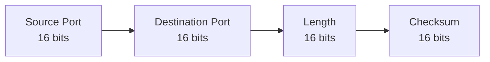
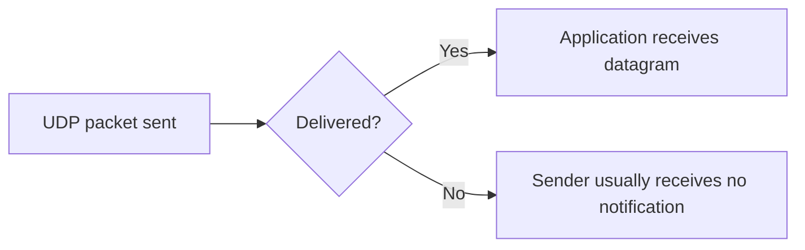
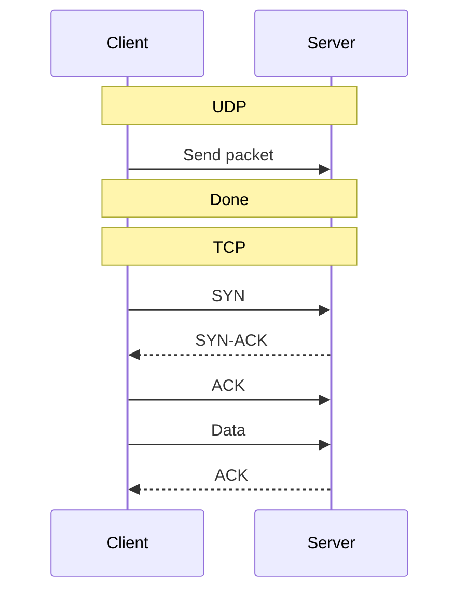

# Lab 09 — UDP and Connectionless Communication

## What This Lab Covers

Phase 4 covers the transport layer — the layer responsible for getting
data between applications on different machines. Two protocols handle
this: UDP and TCP.

UDP is examined first because it is simpler. Understanding what UDP
does not do makes TCP's design decisions easier to understand.

UDP has appeared in captures throughout this repo — DNS queries on
port 53, NTP time sync, DHCP. It was never examined directly. This
lab examines it directly.

---

## Prerequisites

Lab 08 completed. Routing, ICMP, and traceroute are understood.
tcpdump and netcat are installed. DNS traffic has been captured
in earlier labs.

---

## Ports — How Applications Share a Network Interface

Before examining UDP, the concept of ports needs context. It applies
equally to UDP and TCP.

An IP address gets a packet to the right machine. But a machine runs
many applications simultaneously — a web server, a DNS resolver, an
SSH daemon, a database. When a packet arrives, the kernel needs to
know which application should receive it. That is what ports do.

**The analogy:** An IP address is the address of an apartment building.
A port is the apartment number. The postal carrier delivers to the
building (IP address). The apartment number (port) routes it to the
correct resident (application).

```
Incoming packet to 172.20.193.120:53
                   ────────────────────
                   IP address = building address
                            53 = apartment number (DNS application)
```

Port numbers run from 0 to 65535. The well-known ones:

| Port | Protocol | Used by |
|---|---|---|
| 22 | TCP | SSH |
| 53 | UDP / TCP | DNS |
| 67, 68 | UDP | DHCP |
| 80 | TCP | HTTP |
| 123 | UDP | NTP |
| 443 | TCP | HTTPS |

These numbers were present in every `ss -tulnp` output since Lab 02.
The port concept applies to both UDP and TCP — the difference between
the two protocols is how they use those ports.

---

## What UDP Is

UDP (User Datagram Protocol) is a transport protocol. It takes
application data, wraps it in a minimal header, and hands it to
the IP layer for delivery.

That is the complete description. UDP adds only minimal transport-layer functionality beyond ports,
length, and checksum handling.

**The analogy:** UDP is like dropping a letter into a public mailbox.
You write the destination address (IP + port), drop it in, and walk
away. There is no tracking number. No delivery confirmation. No
notification if the letter is lost. The sending application never
finds out whether the letter arrived.

**What "connectionless" means:** TCP establishes a connection before
exchanging data — both sides agree to talk, exchange sequence numbers,
and confirm they are ready. UDP skips all of that. A UDP packet is
sent directly. No negotiation, no setup, no teardown.

---

## The UDP Header

UDP adds 8 bytes of header to the application data. That is the entire
overhead UDP introduces.



Four fields. Source port, destination port, total length, checksum.
No sequence numbers. No acknowledgement numbers. No flags. No window
size. TCP has all of those — its minimum header is 20 bytes, and it
can reach 60 bytes with options.

The small header is why UDP is fast. There is no mechanism to track
whether packets arrived, so there is nothing to track.

---

## Capturing DNS Over UDP

DNS is the most common UDP protocol encountered in daily DevOps work.
Every `curl`, every service connection, every Kubernetes pod that
resolves a service name — all of it generates DNS over UDP.

DNS has been captured briefly in earlier labs. This is the first
focused examination.

```bash
sudo tcpdump -i any port 53 -nn &
dig google.com
sudo pkill tcpdump
```

```
listening on any, link-type LINUX_SLL2 (Linux cooked v2), snapshot length 262144 bytes
16:21:55.864891 lo    In  IP 10.255.255.254.38862 > 10.255.255.254.53: 50851+ [1au] A? google.com. (51)
16:21:55.884574 lo    In  IP 10.255.255.254.53 > 10.255.255.254.38862: 50851 1/0/1 A 142.250.202.238 (55)

2 packets captured
4 packets received by filter
0 packets dropped by kernel
```

A simple DNS lookup over UDP usually produces one query packet and one
response packet.

```text
16:21:55.864891 lo    In  IP 10.255.255.254.38862 > 10.255.255.254.53: 50851+ [1au] A? google.com. (51)
16:21:55.884574 lo    In  IP 10.255.255.254.53 > 10.255.255.254.38862: 50851 1/0/1 A 142.250.202.238 (55)
```

The first line is the DNS query. A temporary high-numbered source port
(`38862`) sends a request to port `53`, the standard DNS server port.

```text
A? google.com.
```

means:
- request type `A`
- asking for the IPv4 address of `google.com`

The second line is the response. The source and destination reverse,
and the resolver replies with the answer:

```text
A 142.250.202.238
```

meaning `google.com` resolved to that IP address.

Notice that both packets use the same IP address:
`10.255.255.254`.

In this WSL2 environment, DNS requests are handled through an internal
local resolver running on the loopback interface (`lo`) before being
forwarded outward by the Windows host.

The important observation is how small the exchange is:
- one query
- one response
- no connection setup
- no teardown

This is UDP's connectionless behavior in practice.

Now observe DNS caching behavior:

```bash
dig google.com | grep "Query time"
dig google.com | grep "Query time"
dig google.com | grep "Query time"
```

```
;; Query time: 16 msec
;; Query time: 4 msec
;; Query time: 4 msec
```

The later queries are usually faster because the resolver already cached
the answer from the first lookup.

---

## Sending UDP with netcat

netcat (nc) was used for TCP connections in earlier labs. The `-u`
flag switches it to UDP mode.

Open two terminals.

**Terminal 1 — start a UDP listener:**
```bash
nc -u -l 9999
```

`-u` = UDP mode, `-l` = listen on port 9999

**Verify the socket appeared:**
```bash
ss -ulnp | grep 9999
```

```
UNCONN 0      0             0.0.0.0:9999      0.0.0.0:*    users:(("nc",pid=236872,fd=3))
```

The `UNCONN` state in the ss output is UDP-specific. UDP has no
connection state — there is no established, no handshake, no SYN.
The socket simply exists, waiting for datagrams to arrive.

**Terminal 2 — send UDP to the listener:**
```bash
nc -u localhost 9999
```

Type a message and press Enter. It appears in Terminal 1.
Type a reply in Terminal 1 and press Enter. It appears in Terminal 2.

**Capture what this looks like at the packet level:**
```bash
sudo tcpdump -i lo udp port 9999 -nn
```

Send a few messages back and forth, then stop the capture.

```
16:40:08.029112 IP 127.0.0.1.9999 > 127.0.0.1.53634: UDP, length 6
16:40:13.556188 IP 127.0.0.1.53634 > 127.0.0.1.9999: UDP, length 22
16:40:23.546318 IP 127.0.0.1.9999 > 127.0.0.1.53634: UDP, length 19
16:40:27.902132 IP 127.0.0.1.53634 > 127.0.0.1.9999: UDP, length 19
```

Each line in the capture is one message — one UDP datagram. There is
no connection setup visible before the first message. No acknowledgement
visible after any message. Packets appear and that is it.

Note: UDP traffic between local processes goes through the loopback
interface (`lo`), not `eth0`. This is why `-i lo` is used here rather
than `-i eth0`.

---

## What Happens When UDP is Dropped



The defining characteristic of UDP is silence on failure. When a UDP
packet is lost, dropped, or never delivered, the sender receives no
notification.

Demonstrate this with two scenarios.

**Scenario 1 — UDP to a port with nothing listening:**

```bash
sudo tcpdump -i lo 'udp or icmp' -nn &
echo "hello" | nc -u -w 1 localhost 8888
sudo pkill tcpdump
```

```
16:43:16.353985 IP 127.0.0.1.36174 > 127.0.0.1.8888: UDP, length 6
16:43:16.354382 IP 127.0.0.1 > 127.0.0.1: ICMP 127.0.0.1 udp port 8888 unreachable, length 42
```

The capture shows the UDP packet going out. An ICMP Port Unreachable
message comes back (because nothing is listening on port 8888). But
`nc` exits silently — no error message is printed to the terminal.

With TCP, attempting to connect to a closed port produces an immediate
"Connection refused" message. UDP produces nothing visible to the
application, even when an ICMP error was returned.

**Scenario 2 — UDP silently dropped by a firewall:**

```bash
# Start a listener
nc -u -l 9999 &

# Block incoming UDP on port 9999
sudo iptables -A INPUT -p udp --dport 9999 -j DROP

# Capture on loopback
sudo tcpdump -i lo udp port 9999 -nn &

# Send UDP toward the blocked port
echo "test" | nc -u -w 2 localhost 9999

sudo pkill tcpdump
sudo iptables -D INPUT -p udp --dport 9999 -j DROP
kill %1 2>/dev/null
```

```
16:45:31.043431 IP 127.0.0.1.59636 > 127.0.0.1.9999: UDP, length 5
```

The UDP packet appears in the capture leaving the sender. Nothing
appears coming back. The sender waited the 2-second timeout (`-w 2`)
and exited silently.

This is what a firewalled UDP port looks like from a sender's
perspective — identical to a lost packet. There is no way to distinguish
between "packet dropped by firewall" and "packet lost in transit" from
UDP alone.

---

## When UDP is the Right Choice

UDP's lack of reliability is not a flaw for certain applications —
it is a feature.

**DNS** — a query and response completes in under 20ms. Adding a
three-way TCP handshake would roughly double the round-trip time for
every single lookup. If a response is lost, the application retries.
The simplicity of UDP is worth the lack of guarantees here.

**NTP** — time synchronisation packets are small and timing is
critical. NTP implements its own mechanisms for dealing with lost
packets. The captures from Lab 03 already showed NTP traffic as UDP.

**DHCP** — a machine requesting an IP address does not yet have an
IP address. TCP requires an existing connection between two known
IPs. DHCP uses UDP broadcast because it must work before any IP
configuration exists.

**Streaming media** — a slightly outdated video frame is better than
a delayed one. If a packet carrying frame 42 is lost, there is no
value in waiting for a retransmission — frame 43 has already been
sent. The stream continues with a minor glitch.

**QUIC and HTTP/3** — the newest development. QUIC implements its
own reliability on top of UDP in userspace. This gives application
developers control over retransmission and ordering without being
constrained by kernel TCP behaviour. The result is faster connection
setup and better handling of packet loss for modern web traffic.

---

## What ss Shows for UDP

```bash
ss -ulnp
```

```
State               Recv-Q              Send-Q                            Local Address:Port                            Peer Address:Port              Process                                      
UNCONN              0                   0                                    127.0.0.54:53                                   0.0.0.0:*                                                              
UNCONN              0                   0                                 127.0.0.53%lo:53                                   0.0.0.0:*                                                              
UNCONN              0                   0                                10.255.255.254:53                                   0.0.0.0:*                                                              
UNCONN              0                   0                                     127.0.0.1:323                                  0.0.0.0:*                                                              
UNCONN              0                   0                                       0.0.0.0:9999                                 0.0.0.0:*                  users:(("nc",pid=239066,fd=3))              
UNCONN              0                   0                                         [::1]:323                                     [::]:*                            
```

UDP sockets always show `UNCONN` — unconnected. There is no LISTEN
state for UDP (unlike TCP), no ESTABLISHED state, no TIME_WAIT. A
UDP socket exists or it does not. The `UNCONN` label is how ss
indicates a waiting UDP socket.

The DNS resolver entries (`127.0.0.54:53`, `127.0.0.53:53`) seen
since Lab 02 are UDP sockets. They have been waiting for DNS queries
this entire time, appearing in this exact state.

---

## UDP vs TCP — Preview



The next lab covers TCP in detail. As a preview, the fundamental
difference:

| | UDP | TCP |
|---|---|---|
| Connection setup | None | Three-way handshake (SYN, SYN-ACK, ACK) |
| Delivery guarantee | None | Retransmits lost packets |
| Ordering | None | Delivered in order |
| Error notification | None | Sender knows if delivery failed |
| Header size | 8 bytes | 20–60 bytes |
| Speed | Fast | Slower (due to overhead) |
| Use when | Speed matters, loss acceptable | Reliability required |

TCP adds all of the things UDP lacks. The next lab captures a full
TCP connection lifecycle — setup, data transfer, and teardown — at
the packet level.

---


*Next: Lab 10 — TCP Handshake and Connection Lifecycle*
*TCP is examined packet by packet — the three-way handshake, connection*
*states visible in ss, graceful close versus reset, and the TIME_WAIT*
*state that appears after every closed connection.*