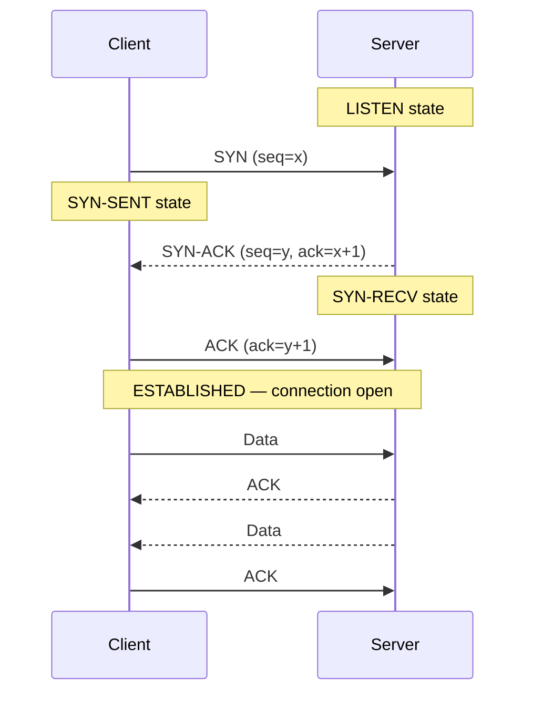
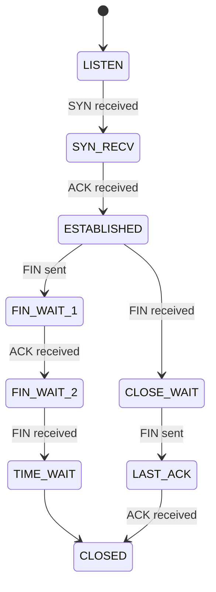
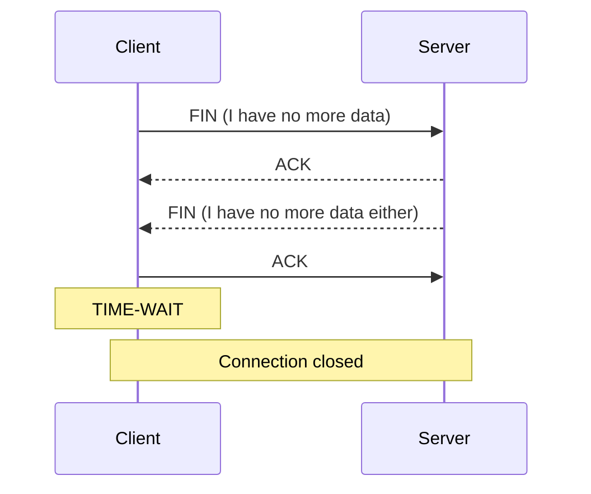
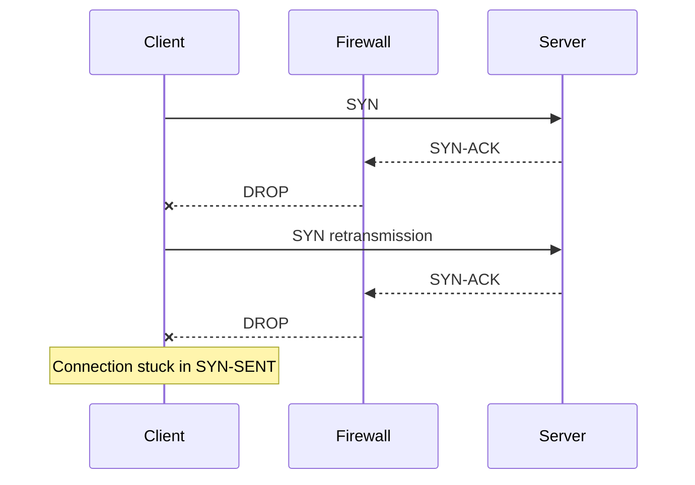
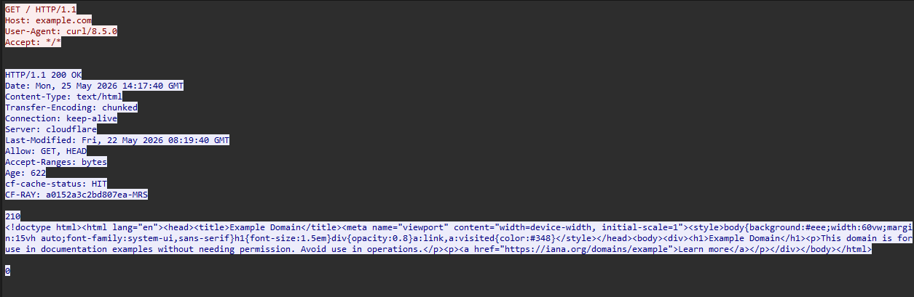

# Lab 10 — TCP Handshake and Connection Lifecycle

## What This Lab Covers

TCP is the protocol behind HTTP, HTTPS, SSH, database connections,
and most application traffic. Understanding how a TCP connection
opens, transfers data, and closes — at the packet level — is the
foundation of diagnosing almost every production connectivity problem.

This lab captures a full TCP connection from start to finish, reads
the packets, watches connection states change in real time, and
examines what happens when connections close gracefully versus abruptly.

---

## Prerequisites

Lab 09 completed. Ports and UDP are understood. The contrast between
connectionless UDP and connection-oriented TCP has been previewed.
tcpdump, netcat, and Wireshark are operational.

---

## Why TCP Exists

UDP sends packets and hopes for the best. For most applications, hope
is not enough. A database query must arrive complete and in order.
An SSH command must not lose characters. An HTTP response must deliver
every byte of the page.

TCP provides three guarantees that UDP does not:

**Delivery** — lost packets are detected and retransmitted automatically.

**Ordering** — packets that arrive out of order are reassembled into
the correct sequence before the application sees them.

**Flow control** — the sender adjusts its speed based on how fast the
receiver can process data. Neither side overwhelms the other.

To provide these guarantees, TCP must establish a connection before
any data flows. Both sides must agree they are ready, synchronise their
sequence numbers, and confirm the channel is working. This is the
three-way handshake.

---

## The Three-Way Handshake

**The analogy:** TCP is like a phone call. Before speaking, both sides
confirm the connection:

```
You dial                    →  SYN      "Can we talk?"
They answer and say hello   →  SYN-ACK  "Yes. Ready when you are."
You say hello back          →  ACK      "Great. Let's go."
```

Only after this exchange does data flow. Both sides now know the channel
works in both directions.



**What each packet carries:**

`SYN` — "I want to connect. My starting sequence number is X." The
sequence number is a random large number chosen by the kernel for
security. It will increment with every byte sent.

`SYN-ACK` — "Connection accepted. My starting sequence number is Y.
I received your sequence X and expect X+1 next." The SYN-ACK
acknowledges the client's sequence number and announces the server's.

`ACK` — "Received. I expect Y+1 next." Connection is now established.
Both sides have confirmed their sequence numbers.

---

## Reading TCP Flags in tcpdump

Before capturing, the notation tcpdump uses for TCP flags needs to
be understood. Each flag is represented by a letter:

| Flag | Letter | Meaning |
|---|---|---|
| SYN | `S` | Synchronise — initiate or accept connection |
| ACK | `.` | Acknowledge — confirms received data |
| FIN | `F` | Finish — no more data to send |
| RST | `R` | Reset — abort connection immediately |
| PSH | `P` | Push — deliver data to application immediately |

A packet with `[S]` is a SYN. A packet with `[S.]` is a SYN+ACK.
A packet with `[F.]` is FIN+ACK. A packet with `[.]` is a pure ACK
with no data.

tcpdump displays ACK as `.` because ACK packets are extremely common in
TCP traffic, and the shorter notation improves readability.

This notation appears in every TCP capture. Recognising it immediately
is necessary to read captures efficiently.

---

## Capturing the Three-Way Handshake

A local netcat connection produces the cleanest capture — no TLS,
no redirects, no background traffic mixed in.

**Start the capture first:**
```bash
sudo tcpdump -i lo 'tcp port 9999' -c 3 -nn
```

**In a second terminal — start a listener:**
```bash
nc -l 9999
```

**In a third terminal — connect:**
```bash
nc localhost 9999
```

Watch the tcpdump output immediately after connecting. Three packets
appear before any typing.

```
18:24:23.437618 IP 127.0.0.1.54752 > 127.0.0.1.9999: Flags [S], seq 2140659081, win 65495, options [mss 65495,sackOK,TS val 102380412 ecr 0,nop,wscale 7], length 0
18:24:23.437944 IP 127.0.0.1.9999 > 127.0.0.1.54752: Flags [S.], seq 3661300681, ack 2140659082, win 65483, options [mss 65495,sackOK,TS val 102380412 ecr 102380412,nop,wscale 7], length 0
18:24:23.437971 IP 127.0.0.1.54752 > 127.0.0.1.9999: Flags [.], ack 1, win 512, options [nop,nop,TS val 102380412 ecr 102380412], length 0
```

The three handshake packets look like this:

```
127.0.0.1.XXXXX > 127.0.0.1.9999:  Flags [S],   seq 123456789
127.0.0.1.9999  > 127.0.0.1.XXXXX: Flags [S.],  seq 987654321, ack 123456790
127.0.0.1.XXXXX > 127.0.0.1.9999:  Flags [.],   ack 987654322
```

The `XXXXX` is the ephemeral source port — a random high number the
kernel chose for this connection. Every connection from a client gets
a unique ephemeral port on the source side.

Notice the acknowledgement numbers: the SYN-ACK acknowledges
`seq + 1`. This is because the SYN flag itself counts as one byte,
even though no application data was sent. The ACK says "I received
your SYN and am ready for byte seq+1."

The handshake packets above establish the connection itself. Internally,
the kernel tracks this process using TCP connection states.

TCP connections move through a defined sequence of states while opening,
transferring data, and closing.



---

## Watching Connection States in Real Time

TCP connections pass through a defined sequence of states. These
states are visible in `ss`.

In a second terminal, watch the states update while the connection
is active:

```bash
watch -n 0.5 'ss -tan | grep 9999'
```

Now observe each state as it appears:

**Before connecting:**
```bash
# Server is listening
ss -tan | grep 9999
```
```
LISTEN   0   1   0.0.0.0:9999   0.0.0.0:*
```

**Immediately after `nc localhost 9999` connects:**
```
ESTABLISHED  0   0   127.0.0.1:9999    127.0.0.1:XXXXX
ESTABLISHED  0   0   127.0.0.1:XXXXX   127.0.0.1:9999
```

Two ESTABLISHED entries appear — one for each side of the connection.
The server side and client side both show ESTABLISHED.

**Type some data and press Enter.** Watch the `ss` output — no state
change, just ESTABLISHED the entire time data flows.

**Close the client with Ctrl+C.**

```
TIME-WAIT  0   0   127.0.0.1:XXXXX   127.0.0.1:9999
```

The TIME-WAIT state appears briefly after the connection closes.

---

## Closing a Connection — FIN and the Four-Way Teardown

Closing a TCP connection gracefully requires four packets because
each side must independently say "I am done sending" and receive
confirmation.

**The analogy:** ending a phone call:
```
You: "Goodbye."           (FIN)
Them: "Got it. Goodbye."  (FIN-ACK)
You: "Got it."            (ACK)
```



In real captures, ACK and FIN are often combined into the same packet.
Depending on timing and when the capture stops, you may see three or
four packets during teardown.

Type something in the netcat session, then close with Ctrl+C on the
client side. The tcpdump output shows:

```
18:48:20.095225 IP 127.0.0.1.9999 > 127.0.0.1.56948: Flags [F.], seq 4253667442, ack 1628866067, win 512, options [nop,nop,TS val 103793215 ecr 103785720], length 0
18:48:20.097458 IP 127.0.0.1.56948 > 127.0.0.1.9999: Flags [.], ack 1, win 512, options [nop,nop,TS val 103793218 ecr 103793215], length 0
18:51:41.651323 IP 127.0.0.1.56948 > 127.0.0.1.9999: Flags [F.], seq 1, ack 1, win 512, options [nop,nop,TS val 103994771 ecr 103793215], length 0
```

Look for packets with `[F.]`:

```text
[F.]
```

`F` means FIN and `.` means ACK. The sender is both acknowledging
previous data and signaling it has no more data to send.

The first FIN packet comes from the server:

```text
127.0.0.1.9999 > 127.0.0.1.56948
```

Later, the client sends its own FIN:

```text
127.0.0.1.56948 > 127.0.0.1.9999
```

This shows an important TCP behavior: each side closes independently.
One side can finish sending while still receiving data from the other.

---

## RST — The Abrupt Close

RST (Reset) is the other way a TCP connection ends. Unlike FIN which
says "I am done sending but the connection can continue in the other
direction," RST says "this connection is terminated immediately, drop
everything."

RST appears in two common situations:

**1. Connecting to a port with nothing listening:**

```bash
sudo tcpdump -i lo 'port 8888' -nn &
nc localhost 8888
sudo pkill tcpdump
```

```
18:55:58.132583 IP 127.0.0.1.58452 > 127.0.0.1.8888: Flags [S], seq 3960100390, win 65495, options [mss 65495,sackOK,TS val 104251253 ecr 0,nop,wscale 7], length 0
18:55:58.132639 IP 127.0.0.1.8888 > 127.0.0.1.58452: Flags [R.], seq 0, ack 3960100391, win 0, length 0
```

The client sends SYN. The kernel on the server side sees no application
listening on port 8888 and immediately replies with RST. The connection
attempt fails instantly — this is what "connection refused" means at
the packet level.

```
127.0.0.1.XXXXX > 127.0.0.1.8888: Flags [S]
127.0.0.1.8888  > 127.0.0.1.XXXXX: Flags [R.]
```

**2. FIN vs RST — the visible difference:**

| | FIN | RST |
|---|---|---|
| Meaning | "I'm done sending" | "Terminate now" |
| Response | Four-way close | No response expected |
| Data in flight | Delivered first | Discarded |
| Appearance | `[F.]` in capture | `[R.]` in capture |
| User sees | Clean disconnect | "Connection reset by peer" |


---

## TIME_WAIT — Why It Exists

After a FIN close, the side that sent the last ACK enters TIME_WAIT.
It stays there for approximately 60 seconds before the port is
considered fully free.

**Why this exists:** TIME_WAIT exists to prevent delayed packets from an old connection
being mistaken for packets belonging to a new connection using the
same port numbers.

```bash
# After closing a netcat connection, check for TIME_WAIT
ss -tan state time-wait
```

```
Recv-Q                    Send-Q                                        Local Address:Port                                         Peer Address:Port                     Process                    
0                         0                                                 127.0.0.1:9999                                            127.0.0.1:35634               
```

```bash
# See TIME_WAIT with full socket details
ss -tan | grep TIME-WAIT
```

```
TIME-WAIT 0      0           127.0.0.1:9999     127.0.0.1:35634       
```

TIME_WAIT appears on the client side (the side that initiated the
connection close). The server side completes the close and disappears.

In production, a server handling many short-lived connections can
accumulate thousands of TIME_WAIT entries. This is normal. Problems
only arise when the system runs out of available ports — a different
issue than TIME_WAIT itself.

---

## Half-Open Connections and Retransmissions

A half-open connection exists when the client sends SYN but never
receives SYN-ACK. This happens when a firewall silently drops the
response, when the server is overloaded, or during certain attack
patterns.



```bash
# Start a listener
nc -l 9999 &

# Drop SYN-ACK responses from port 9999 (so our client never gets the reply)
sudo iptables -A INPUT -p tcp --sport 9999 --tcp-flags SYN,ACK SYN,ACK -j DROP

# Start capturing
sudo tcpdump -i lo 'port 9999' -nn &

# Try to connect — this will hang
nc -w 10 localhost 9999 &

# Check the connection state immediately
ss -tan | grep 9999
```

```
[paste ss output here — should show SYN-SENT]

LISTEN    0      1             0.0.0.0:9999        0.0.0.0:*           
SYN-SENT  0      1           127.0.0.1:38928     127.0.0.1:9999        
SYN-RECV  0      0           127.0.0.1:9999      127.0.0.1:38928 
```

```
[paste tcpdump output — should show repeated SYN with no reply]

19:08:30.091328 IP 127.0.0.1.38928 > 127.0.0.1.9999: Flags [S], seq 820310910, win 65495, options [mss 65495,sackOK,TS val 104813856 ecr 0,nop,wscale 7], length 0
19:08:30.091408 IP 127.0.0.1.9999 > 127.0.0.1.38928: Flags [S.], seq 2444903844, ack 820310911, win 65483, options [mss 65495,sackOK,TS val 104813856 ecr 104813856,nop,wscale 7], length 0
19:08:31.092671 IP 127.0.0.1.38928 > 127.0.0.1.9999: Flags [S], seq 820310910, win 65495, options [mss 65495,sackOK,TS val 104814858 ecr 0,nop,wscale 7], length 0
19:08:31.092707 IP 127.0.0.1.9999 > 127.0.0.1.38928: Flags [S.], seq 2444903844, ack 820310911, win 65483, options [mss 65495,sackOK,TS val 104814858 ecr 104813856,nop,wscale 7], length 0
19:08:31.092711 IP 127.0.0.1.9999 > 127.0.0.1.38928: Flags [S.], seq 2444903844, ack 820310911, win 65483, options [mss 65495,sackOK,TS val 104814858 ecr 104813856,nop,wscale 7], length 0
```

The client stays in `SYN-SENT` because it never successfully receives
the SYN-ACK reply needed to complete the handshake.

The server enters `SYN-RECV` because it received the SYN and replied
with SYN-ACK, but never received the final ACK from the client.

Notice that tcpdump still shows SYN-ACK packets:

```text
Flags [S.]
```

These packets were generated by the server, but the iptables rule
dropped them before the client TCP stack could process them.

Because the client never sees a valid reply, the kernel retransmits
the SYN repeatedly.

The wait time between retransmissions increases over time:
- 1 second
- 2 seconds
- 4 seconds
- 8 seconds

This is exponential backoff.

This is the packet-level explanation of a connection timeout. The
server is not refusing the connection — the handshake simply never
completes successfully.

Compare this to `connection refused` (RST), where failure happens
immediately because the destination actively rejects the connection.

Clean up:
```bash
sudo pkill tcpdump
sudo iptables -D INPUT -p tcp --sport 9999 --tcp-flags SYN,ACK SYN,ACK -j DROP
kill %1 %2 2>/dev/null
```

---

## Capturing a Real Connection to an External Server

The netcat exercise shows the mechanics cleanly. Capturing a real
curl request to a website shows TCP in context with actual application
data.

```bash
sudo tcpdump -i eth0 'host example.com and tcp' -nn -w captures/lab-10-curl-tcp.pcap &
curl http://example.com -o /dev/null -s
sudo pkill tcpdump
```

Open `captures/lab-10-curl-tcp.pcap` in Wireshark.

In the packet list, the sequence is:
1. Three-way handshake — `[S]`, `[S.]`, `[.]`
2. HTTP request — `[P.]` (push flag, data follows)
3. ACKs from server — `[.]`
4. HTTP response data — `[P.]` from server
5. ACKs from client — `[.]`
6. FIN close — `[F.]`, `[F.]`, `[.]`

Right-click any packet in the HTTP portion and select
**Follow → TCP Stream**. The entire conversation appears as readable
text — HTTP request headers on one side, HTTP response headers and
body on the other.



---

## Connection States Reference

All TCP states that appear in `ss` output:

| State | Meaning |
|---|---|
| `LISTEN` | Application waiting for incoming connections |
| `SYN-SENT` | SYN sent, waiting for SYN-ACK |
| `SYN-RECV` | SYN-ACK sent, waiting for final ACK |
| `ESTABLISHED` | Connection open, data can flow |
| `FIN-WAIT-1` | FIN sent, waiting for ACK |
| `FIN-WAIT-2` | ACK received for our FIN, waiting for remote FIN |
| `TIME-WAIT` | Both FINs exchanged, waiting for delayed packets to expire |
| `CLOSE-WAIT` | Remote FIN received, application has not closed yet |
| `LAST-ACK` | FIN sent after CLOSE-WAIT, waiting for final ACK |
| `CLOSED` | Connection fully terminated |

In practice, `ss -tan` will mostly show `LISTEN`, `ESTABLISHED`, and
`TIME-WAIT`. The others are transition states that appear briefly.

---

## What This Means for Production Debugging

**"Connection refused" → RST received.** The port is closed. Either
the service is not running or it is listening on a different port.
Check with `ss -tulnp`.

**"Connection timed out" → SYN sent, no reply received.** The packet
is being silently dropped. Could be a firewall rule, a wrong IP, or
the host being unreachable. Check routing with `ip route get`, check
firewall with `iptables -L`.

**"Connection reset by peer" → RST received after connection established.**
The remote application forcibly terminated the connection. Could be a
timeout on their side, a proxy dropping idle connections, or an
application crash.

**Many TIME_WAIT entries in `ss -tan`** → Normal for servers handling
high request rates. Only a problem if all ephemeral ports are exhausted.

These four patterns cover the majority of TCP-level failures encountered
in production.

---


*Next: Lab 11 — TCP Failures and Diagnosis*
*Refused, timeout, retransmission, and zero window are examined*
*as the four distinct TCP failure modes — what each looks like in*
*a capture and what caused it.*