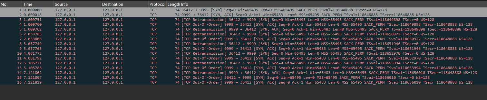

# Lab 11 — TCP Failures and Diagnosis

## What This Lab Covers

Lab 10 showed the happy path — a TCP connection opening, transferring
data, and closing cleanly. In production, the happy path is rarely
where problems happen.

This lab examines the four TCP failure modes that account for the
majority of connectivity problems encountered in DevOps work:
connection refused, connection timeout, retransmissions, and zero
window. Each has a distinct signature in packet captures that makes
diagnosis possible without guessing.

---

## Prerequisites

Lab 10 completed. The three-way handshake, TCP flags in tcpdump,
FIN vs RST, and TIME_WAIT are understood. iptables was used in Lab 10
for the half-open connection exercise.

---

## The Two Questions That Matter Most

When a connection fails, two questions immediately narrow the cause:

**How quickly did it fail?**

| Failure type | How long it takes | Cause |
|---|---|---|
| Connection refused | Under 1 second | RST received — port closed or service down |
| Connection timeout | 10 seconds to minutes | No response — firewall DROP or host unreachable |

An instant failure means something actively rejected the connection.
A slow failure means packets are being silently discarded somewhere.

This distinction alone tells you where to look next. Refused → check
if the service is running and listening on the right port. Timeout →
check firewall rules and routing.

---

## Connection Refused — RST in Under a Millisecond

Connection refused happens when the client sends SYN and the remote
host sends back RST immediately. The port is closed — either nothing
is listening there, or the application explicitly rejected the
connection.

```bash
# Capture the exchange
sudo tcpdump -i lo 'port 8888' -nn &

# Connect to a port with nothing listening
nc localhost 8888

sudo pkill tcpdump
```

```
15:41:21.964904 IP 127.0.0.1.59190 > 127.0.0.1.8888: Flags [S], ...
15:41:21.964948 IP 127.0.0.1.8888 > 127.0.0.1.59190: Flags [R.], ...
```

Two packets appear immediately:

```
127.0.0.1.XXXXX > 127.0.0.1.8888: Flags [S]    ← SYN sent
127.0.0.1.8888  > 127.0.0.1.XXXXX: Flags [R.]   ← RST received
```

The kernel on the receiving side sees SYN arrive on a port with no
application listening. Rather than ignoring it, the kernel sends RST
back immediately. The kernel itself generates this RST — no application
involvement.

nc exits with "Connection refused." The failure is instantaneous
because RST does not wait for a timeout.

**What to check when you see this:**
```bash
# Is anything listening on that port?
ss -tulnp | grep 8888

# Is the service running?
# (service-specific commands — systemctl status, ps, etc.)
```

---

## Connection Timeout — Waiting in the Dark

Connection timeout happens when SYN is sent and no reply arrives.
The client waits, retransmits, waits longer, retransmits again with
the wait doubling each time. This is called exponential backoff.

**The analogy:** knocking on a door that has no one home. You knock,
wait, knock again, wait twice as long, knock again. You never get
a response. Eventually you give up.

```bash
# Start a server — it needs to exist so we get past ARP
nc -l 9999 &

# Drop incoming SYN-ACK packets so the handshake never completes
sudo iptables -A INPUT -p tcp --sport 9999 --tcp-flags SYN,ACK SYN,ACK -j DROP

# Capture the retransmissions
sudo tcpdump -i lo 'port 9999' -nn &

# Try to connect with a 30-second timeout
nc -w 30 localhost 9999 &

# Wait and watch the capture
sleep 20
sudo pkill tcpdump
```

```
15:44:41.018879 IP 127.0.0.1.50572 > 127.0.0.1.9999: Flags [S], ...
15:44:41.018968 IP 127.0.0.1.9999 > 127.0.0.1.50572: Flags [S.], ...
15:44:42.040524 IP 127.0.0.1.50572 > 127.0.0.1.9999: Flags [S], ...
15:44:42.040532 IP 127.0.0.1.9999 > 127.0.0.1.50572: Flags [S.], ...
15:44:42.040534 IP 127.0.0.1.9999 > 127.0.0.1.50572: Flags [S.], ...
15:44:43.068534 IP 127.0.0.1.50572 > 127.0.0.1.9999: Flags [S], ...
15:44:43.068555 IP 127.0.0.1.9999 > 127.0.0.1.50572: Flags [S.], ...
15:44:44.088511 IP 127.0.0.1.50572 > 127.0.0.1.9999: Flags [S], ...
15:44:44.088527 IP 127.0.0.1.9999 > 127.0.0.1.50572: Flags [S.], ...
15:44:45.112519 IP 127.0.0.1.50572 > 127.0.0.1.9999: Flags [S], ...
```

The capture shows the SYN packet retransmitted repeatedly:

```
TIME+0.0s   127.0.0.1.XXXXX > 127.0.0.1.9999: Flags [S]   ← first attempt
TIME+1.0s   127.0.0.1.XXXXX > 127.0.0.1.9999: Flags [S]   ← retry after 1s
TIME+3.0s   127.0.0.1.XXXXX > 127.0.0.1.9999: Flags [S]   ← retry after 2s
TIME+7.0s   127.0.0.1.XXXXX > 127.0.0.1.9999: Flags [S]   ← retry after 4s
TIME+15.0s  127.0.0.1.XXXXX > 127.0.0.1.9999: Flags [S]   ← retry after 8s
```

Each retry doubles the wait time. The total time before giving up
depends on the system configuration and the `-w` flag on nc.

Clean up:
```bash
sudo iptables -D INPUT -p tcp --sport 9999 --tcp-flags SYN,ACK SYN,ACK -j DROP
kill %1 %2 2>/dev/null
```

**What to check when you see this:**
```bash
# Is the host reachable at all?
ping -c 3 <host>

# Is routing correct?
ip route get <host>

# Is a firewall blocking?
sudo iptables -L -v -n
```

---

## DROP vs REJECT — The Practical Difference

iptables can block traffic in two ways: DROP silently discards the
packet, REJECT sends back an RST. The result for the client is very
different.

Run both and time them:

```bash
# Test 1: REJECT — immediate failure
sudo iptables -A INPUT -p tcp --dport 7777 -j REJECT
time nc -w 5 localhost 7777
sudo iptables -D INPUT -p tcp --dport 7777 -j REJECT
```

```
real    0m0.010s
user    0m0.000s
sys     0m0.005s
```

```bash
# Test 2: DROP — silent failure, waits for timeout
sudo iptables -A INPUT -p tcp --dport 7777 -j DROP
time nc -w 5 localhost 7777
sudo iptables -D INPUT -p tcp --dport 7777 -j DROP
```

```
real    0m5.010s
user    0m0.002s
sys     0m0.003s
```

The timing difference is visible without a packet capture. REJECT
fails in under a second. DROP fails only after the timeout expires.

Now capture the difference at the packet level:

```bash
# REJECT capture
sudo tcpdump -i lo 'port 7777' -nn &
sudo iptables -A INPUT -p tcp --dport 7777 -j REJECT
nc localhost 7777
sudo iptables -D INPUT -p tcp --dport 7777 -j REJECT
sudo pkill tcpdump
```

```
15:51:09.332288 IP 127.0.0.1.58362 > 127.0.0.1.7777: Flags [S], ...
```

```bash
# DROP capture
sudo tcpdump -i lo 'port 7777' -nn &
sudo iptables -A INPUT -p tcp --dport 7777 -j DROP
nc -w 8 localhost 7777 &
sleep 8
sudo iptables -D INPUT -p tcp --dport 7777 -j DROP
sudo pkill tcpdump
kill %1 2>/dev/null
```

```
15:52:01.014084 IP 127.0.0.1.50802 > 127.0.0.1.7777: Flags [S], ...
15:52:02.036919 IP 127.0.0.1.50802 > 127.0.0.1.7777: Flags [S], ...
15:52:03.061108 IP 127.0.0.1.50802 > 127.0.0.1.7777: Flags [S], ...
15:52:04.085313 IP 127.0.0.1.50802 > 127.0.0.1.7777: Flags [S], ...
15:52:05.108927 IP 127.0.0.1.50802 > 127.0.0.1.7777: Flags [S], ...
15:52:06.132923 IP 127.0.0.1.50802 > 127.0.0.1.7777: Flags [S], ...
15:52:08.148952 IP 127.0.0.1.50802 > 127.0.0.1.7777: Flags [S], ...
```

The REJECT test fails immediately even though the capture only clearly
shows the SYN packet here.

On some systems — especially localhost and WSL2 loopback captures —
the RST response happens so quickly that tcpdump may not display it
before the capture stops.

The important operational observation is the behavior difference:
- REJECT fails instantly
- DROP hangs and retransmits repeatedly

**REJECT capture shows:**

In real production captures on remote systems, REJECT usually appears
as:

```
SYN → RST  (two packets, instant failure)
```

**DROP capture shows:**
```
SYN
SYN  (retry after 1s)
SYN  (retry after 2s)
SYN  (retry after 4s)
...  (no RST ever appears)
```

**The operational implication:**

| | REJECT | DROP |
|---|---|---|
| User experience | "Connection refused" immediately | Hangs then times out |
| Information revealed | Confirms the host exists | Looks like the host might be down |
| Legitimate user impact | Fails fast — less frustrating | Waits for full timeout |
| Common use | Internal services, explicit block | Security, hide existence |

In AWS, security groups silently DROP by default. NACLs can be
configured to REJECT. This is why AWS connectivity failures often
look like timeouts rather than immediate refusals.

---

## Retransmissions — When Packets Get Lost

Retransmissions happen whenever a TCP sender does not receive an ACK
within the expected time window. The sender assumes the packet was
lost and sends it again.

Retransmissions are not only a failure indicator — they happen during
normal operation on lossy networks. The difference is frequency:
occasional retransmissions are normal, continuous retransmissions
indicate a problem.

**The mechanism is the same as the SYN retransmissions seen above.**
When a DATA packet is sent and the ACK does not arrive, the same
exponential backoff applies: resend after 1s, then 2s, then 4s.

**What retransmissions look like in Wireshark:**

Retransmissions become much easier to understand visually in
Wireshark than in raw tcpdump output.

Start a capture that intentionally causes retransmissions:

```bash
# Start listener
nc -l 9999 &

# Drop SYN-ACK packets
sudo iptables -A INPUT -p tcp --sport 9999 --tcp-flags SYN,ACK SYN,ACK -j DROP

# Capture traffic
sudo tcpdump -i lo 'tcp port 9999' -w captures/lab-11-retransmissions.pcap &

# Attempt connection (will hang)
nc -w 10 localhost 9999

# Stop capture
sudo pkill tcpdump
```

Clean up:

```bash
sudo iptables -D INPUT -p tcp --sport 9999 --tcp-flags SYN,ACK SYN,ACK -j DROP
kill %1 2>/dev/null
```

Open the capture in Wireshark. Wireshark automatically detects and highlights retransmissions.

In the packet list:
- repeated SYN packets appear
- retransmitted packets are highlighted
- the Info column shows:
  - `[TCP Retransmission]`
  - `[TCP Spurious Retransmission]`


A real retransmission capture in Wireshark looks like this:



The repeated SYN packets demonstrate the kernel retrying the connection
because the SYN-ACK replies never successfully reached the client.


**What causes retransmissions in production:**
- Physical network issues — cable problems, overloaded switches
- Congestion — too much traffic on a link, packets being dropped
- Firewall dropping packets mid-connection
- VM or container networking overhead in busy environments
- Long geographic distances (high latency pushes edge cases)

**How to observe retransmission impact:**

```bash
ss -s
```

```
Total: 360
TCP:   53 (estab 8, closed 38, orphaned 0, timewait 1)

Transport Total     IP        IPv6
RAW       0         0         0        
UDP       5         4         1        
TCP       15        14        1        
INET      20        18        2        
FRAG      0         0         0      
```

`ss -s` provides a high-level summary of socket and TCP activity on
the system.

The important fields here are:
- `estab` — currently established TCP connections
- `closed` — recently closed TCP connections
- `timewait` — connections waiting in TIME_WAIT state

During heavy retransmission events, the number of active and stuck TCP connections often increases. Combined with packet captures and Wireshark retransmission warnings, this helps confirm transport-layer connectivity problems.

---

## TCP Keepalive — Detecting Dead Connections

A TCP connection can stay in ESTABLISHED state indefinitely with no
data flowing. The connection exists as kernel state, but if one end
silently disappears — machine reboots, network drops, process dies
without sending FIN — the other end has no way to know.

Keepalive is TCP's solution. After a period of inactivity, the kernel
sends small probe packets to check if the other end is still alive.
If no response comes after several probes, the connection is declared
dead and closed.

**The analogy:** periodically calling a colleague to ask "still there?"
If they stop answering after several attempts, you assume the call
dropped.

Check the default keepalive settings on the system:

```bash
# How long to wait before sending first probe (seconds)
cat /proc/sys/net/ipv4/tcp_keepalive_time

# How often to send probes after the first one (seconds)
cat /proc/sys/net/ipv4/tcp_keepalive_intvl

# How many failed probes before closing the connection
cat /proc/sys/net/ipv4/tcp_keepalive_probes
```

```
7200
75
9
```

The Linux defaults are typically:
- `tcp_keepalive_time`: 7200 (2 hours idle before first probe)
- `tcp_keepalive_intvl`: 75 (75 seconds between probes)
- `tcp_keepalive_probes`: 9 (give up after 9 failed probes)

With defaults, a dead connection is detected after approximately:
**2 hours + (75s × 9 probes) = about 2 hours and 11 minutes.**

In production, applications usually configure much shorter keepalive
times. An SSH session might probe after 60 seconds of inactivity.
A database connection pool might probe every 30 seconds. The kernel
defaults are just the fallback if the application does not configure
its own.

**Why this matters:**
- SSH sessions that "hang" after network interruption are keepalive
  not firing fast enough
- Database connections that appear ESTABLISHED but return errors have
  often silently died — keepalive would have detected this earlier
- Load balancers often close idle connections after 30-300 seconds —
  an application without keepalive may hold a "ESTABLISHED" connection
  that is actually dead at the load balancer

**Checking if keepalive is enabled on a connection:**
```bash
# See keepalive timer on active connections
ss -tan -o | grep ESTABLISHED | head -5
```

```
No output
```

The `-o` flag shows timer information. A connection with keepalive
enabled shows `keepalive (...)` in the timer column with the remaining
time until the next probe.

---

## Zero Window — When the Receiver Is Full

Zero window is a flow control mechanism, not a failure. But it can
look like a failure when it appears unexpectedly.

Every TCP connection has a receive buffer — a memory area where
incoming data sits until the application reads it. The receiver tells
the sender its current buffer space via the window size field in
every TCP packet.

When the buffer fills up completely, the window size drops to zero.
The sender must stop sending data entirely and wait. The receiver
sends a window update when space becomes available.

In a packet capture, zero window looks like this:
```
Server > Client: Flags [.], ack X, win 0   ← window is zero
...silence...
Server > Client: Flags [.], ack X, win 512  ← window reopens
Client > Server: Flags [P.], data            ← sender resumes
```

Wireshark labels these as `[TCP Zero Window]` and `[TCP Window Full]`.

**When this appears in production:**
- Application is reading data too slowly (processing bottleneck)
- Memory pressure causing buffers to shrink
- Consumer service overloaded while producer keeps sending

Zero window is a symptom of a processing or resource problem, not a
network problem. If you see it, look at the application layer — the
network is working correctly, but the receiving process cannot keep up.

---

## The Failure Diagnosis Map

When a connection fails, this sequence quickly identifies the cause:

```
Step 1: How long did it take to fail?
   → Under 1 second:  RST received → connection refused
                      Check: ss -tulnp (is the service listening?)
   → Several seconds: Timeout → packets dropped
                      Go to Step 2

Step 2: Can I reach the host at all?
   → ping works:      Host is up, problem is at layer 4 or above
                      Check: iptables -L (firewall dropping?)
   → ping fails:      Host is down or unreachable
                      Check: ip route get (routing correct?)
                             traceroute (where does path break?)

Step 3: Is the service actually running?
   → ss -tulnp shows the port: service is up, something is filtering
   → ss -tulnp shows nothing:  service is down or wrong port

Step 4: Is data flowing?
   → ESTABLISHED in ss but no data: check for zero window or keepalive
   → Retransmissions in capture:    packet loss somewhere in path
```

---

*Next: Lab 12 — Network Namespaces*
*The Linux primitive that underlies Docker and Kubernetes networking.*
*A network namespace is a completely isolated network stack —*
*its own interfaces, routing table, and iptables rules.*
*Building one by hand makes Docker networking understandable.*